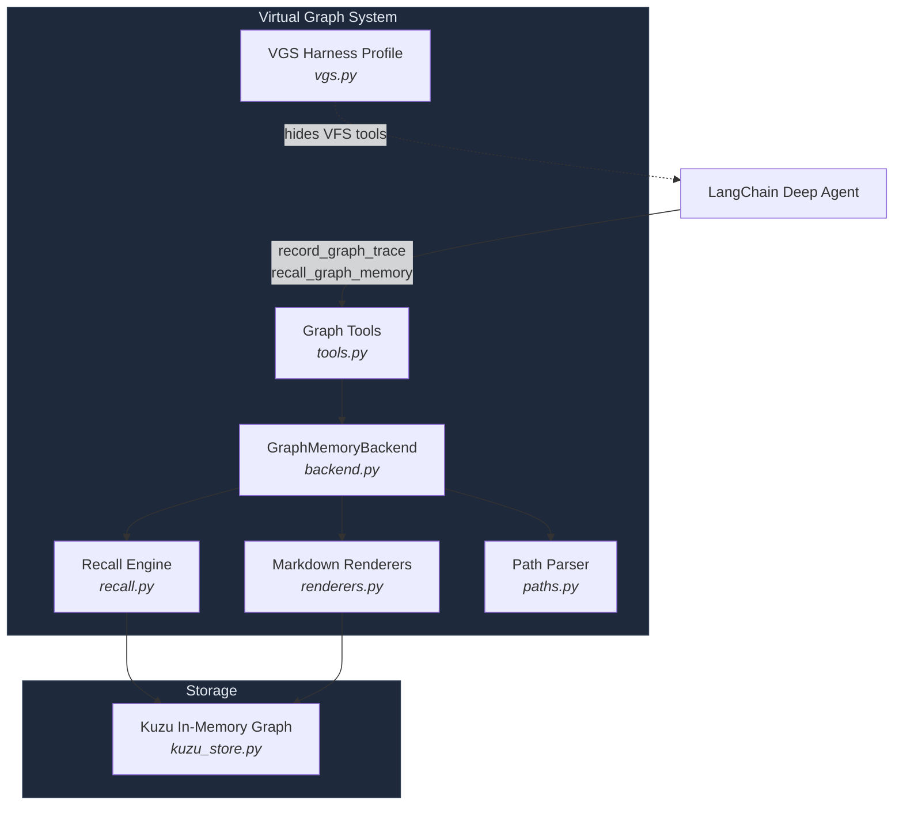
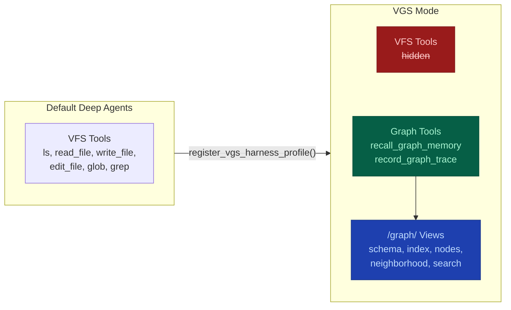
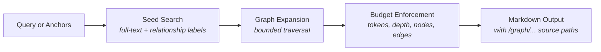

# deepagents-graph-memory

A graph-native context scratchpad for LangChain Deep Agents. Record structured reasoning traces, build connected work state, and recall multi-hop context -- all backed by Kuzu.

[](https://github.com/TahaK29/deepagents-graph-memory)
[](https://python.org)
[](https://kuzudb.com)
[](https://python.langchain.com)
[](https://opensource.org/licenses/MIT)

## Motivation

This project is an implementation of the ideas from Neo4j's [*From Recall to Reasoning: How Context Graphs Upgrade an Agent's Brain*](https://neo4j.com/blog/genai/from-recall-to-reasoning-how-context-graphs-upgrade-an-agents-brain/), applied to the [LangChain Deep Agents](https://github.com/langchain-ai/deepagents) framework.

The paper identifies three levels of agent memory:

| Level | Memory Type | Capability |
|---|---|---|
| **Level 1** | Reactive | Short-term only -- agents respond to immediate observations without learning |
| **Level 2** | Recall | Long-term via vector embeddings -- agents remember past events but lack explicit relationships |
| **Level 3** | Reasoning | Context graphs -- agents understand underlying rules and apply knowledge to novel situations |

Most agent memory systems stop at Level 2: they store embeddings and retrieve by similarity. But **similarity is not relevance** -- as data grows, vector recall generates noise and loses the causal chains that explain *why* something happened, not just *what* happened.

Context graphs solve this by structuring agent experiences as a web of relationships (Situation &rarr; Rationale &rarr; Action &rarr; Outcome), enabling multi-hop reasoning, knowledge transfer across tasks, and the ability to unlearn outdated information.

`deepagents-graph-memory` brings this Level 3 context graph to Deep Agents which is currently at level 2, replacing the flat virtual filesystem with a graph-native scratchpad backed by [Kuzu](https://kuzudb.com). The goal: agents that don't just recall -- they reason.

## What It Does

| Structured Traces | Graph Recall | Virtual Graph Views |
|---|---|---|
| Situation &rarr; Rationale &rarr; Action &rarr; Outcome | Full-text search + bounded traversal | Read-only `/graph/...` markdown projections |
| Connected reasoning chains | Anchor-based seed expansion | Schema, index, node, neighborhood, search |
| Domain-agnostic trace shape | Budget-aware (tokens, depth, nodes, edges) | Inspectable by agents, tests, and humans |

This is **not** ordinary user memory. Don't use it for facts like "the user likes ice cream." Use it for connected work state like *"this failing test led to this hypothesis, this edit, this result, and this final decision."*

**Key features:** controlled graph writes through LangChain tools, VGS harness profile that hides default VFS tools, multi-tenant scoping via namespace factory, and budgeted recall with configurable limits.

## Quick Start

```bash
pip install deepagents-graph-memory
```

```python
from deepagents import create_deep_agent
from deepagents_graph_memory import (
    GraphMemoryBackend,
    graph_memory_tools,
    register_vgs_harness_profile,
)

MODEL = "google_genai:gemini-3.5-flash"

# Hide default VFS tools, enable graph-focused operation
register_vgs_harness_profile(MODEL)

# In-memory Kuzu graph -- no disk, no config
graph_backend = GraphMemoryBackend.create()

agent = create_deep_agent(
    model=MODEL,
    tools=[*graph_memory_tools(graph_backend)],
    memory=["/graph/index.md", "/graph/schema.md"],
    backend=graph_backend,
)
```

## How It Works

### Graph Traces

`record_graph_trace` records the core reasoning shape:

```
Situation -> Rationale -> Action -> Outcome
```

For example:

```
Situation: "sheep saw lion"
Rationale: "lion is dangerous"
Action:    "sheep ran away"
Outcome:   "sheep survived"
```

The graph stores edges like:

```
sheep saw lion --LED_TO--> lion is dangerous
lion is dangerous --JUSTIFIED--> sheep ran away
sheep ran away --PRODUCED--> sheep survived
```

Writes are issued as Kuzu Cypher `MERGE` statements (no raw Cypher is exposed to the agent).

### Graph Recall

`recall_graph_memory` searches for seed facts, expands through useful edges, and returns compact markdown with source `/graph/...` paths. Pass anchors (file paths, run IDs, task IDs) to give recall a concrete starting point.

Recall uses Kuzu full-text (keyword) search to find seed nodes, then bounded Cypher `MATCH` traversal to expand connected context. No vector/embedding search is used.

```python
recall_graph_memory("what services did incident 123 affect and what do they depend on?")
```

## Graph Tools

```python
graph_memory_tools(graph_backend)
```

| Tool | Purpose |
|---|---|
| `recall_graph_memory` | Primary read path -- search, expand, return context |
| `record_graph_trace` | High-level write -- Situation &rarr; Rationale &rarr; Action &rarr; Outcome |

Low-level write tools are available for application builders but not exposed by default, since unconstrained agents can create drifting labels and relationship types:

```python
graph_memory_tools(graph_backend, include_low_level_writes=True)
```

| Tool | Purpose |
|---|---|
| `add_graph_node` | Create or update entities |
| `add_graph_edge` | Create or update relationships |
| `add_graph_documents` | Ingest LangChain documents |

For production use, prefer domain-specific tools that call `graph_backend.add_graph_node(...)` and `graph_backend.add_graph_edge(...)` with your application's approved labels and relationships.

## Virtual Graph Views

The backend projects graph state into read-only markdown paths:

| Path | Description |
|---|---|
| `/graph/schema.md` | Current graph schema |
| `/graph/index.md` | Graph memory landing page |
| `/graph/nodes/{label}/{id}.md` | Single node with properties and relationships |
| `/graph/views/neighborhood/{label}/{id}.md` | Node with immediate connections |
| `/graph/search/{query}.md` | Search results with preview text |

These are inspectable views, not storage. Writes go through graph tools, not file operations.

## VGS Mode

When VGS (Virtual Graph System) is enabled via `register_vgs_harness_profile`:

- Graph memory tools are exposed
- Deep Agents default VFS tools are hidden: `ls`, `read_file`, `write_file`, `edit_file`, `glob`, `grep`
- The agent works through graph tools instead of the filesystem surface
- VGS prompt guidance is injected automatically

VGS should be **off by default** in a normal Deep Agents install. Enable it only when graph-structured context is needed.

## Architecture

### System Overview



### Default vs VGS Mode



### Recall Pipeline



### Trace Data Model


### Module Reference

| Component | Module | Description |
|---|---|---|
| **Backend** | `backend.py` | `BackendProtocol` implementation for Deep Agents |
| **Graph Store** | `kuzu_store.py` | Kuzu adapter with FTS indexing and scoped queries |
| **Recall Engine** | `recall.py` | Seed search &rarr; expansion &rarr; budget enforcement &rarr; markdown output |
| **Tools** | `tools.py` | LangChain tools with error boundaries |
| **Renderers** | `renderers.py` | Graph data &rarr; markdown view projections |
| **Paths** | `paths.py` | Virtual path parsing and validation |
| **VGS Profile** | `vgs.py` | Harness profile helpers and prompt middleware |
| **Errors** | `errors.py` | `GraphMemoryError`, `GraphMemoryConfigurationError`, `GraphMemoryPathError`, `GraphMemoryValidationError` |

## Example Domain: SRE

VGS is domain-agnostic; here is one example of how a project might shape its labels and relationships:

```
Langfuse DEPENDS_ON Redis
Langfuse DEPENDS_ON Postgres
SRE Team OWNS Langfuse
Incident 123 AFFECTED Langfuse
Incident 123 RESOLVED_BY "Restart Ingestion Workers" Runbook
```

Recall query:
```python
recall_graph_memory("what services did incident 123 affect and what do they depend on?")
```

## Installation

```bash
pip install deepagents-graph-memory           # Core (includes Kuzu + LangChain)
pip install deepagents-graph-memory[test]      # + pytest, ruff
```

### Requirements

- Python 3.11+
- Deep Agents 0.5.2+
- Kuzu 0.11.3+

## Development

```bash
git clone https://github.com/TahaK29/deepagents-graph-memory.git
cd deepagents-graph-memory
pip install -e ".[test]"
python3 -m pytest -q                          # Run all tests
python3 -m ruff check .                       # Lint
```

## Design

`GraphMemoryBackend.create()` creates a Kuzu in-memory graph via `kuzu.Database(":memory:")`. Data lives in the Python process's RAM -- works on a laptop, VM, or container, but is lost on restart and not shared across workers.

Recall uses full-text search to find seed nodes, relationship-label search for relationship-oriented questions, and bounded graph traversal to recover connected context. Vector search and graph algorithms are intentionally not part of the default recall path.

Raw Cypher is not exposed as an agent-facing read or write path. Generated graph views are read-only projections.

For the full design rationale, see [DESIGN.md](DESIGN.md).

## License

MIT

---

**deepagents-graph-memory** is experimental. [GitHub Issues](https://github.com/TahaK29/deepagents-graph-memory/issues) 
