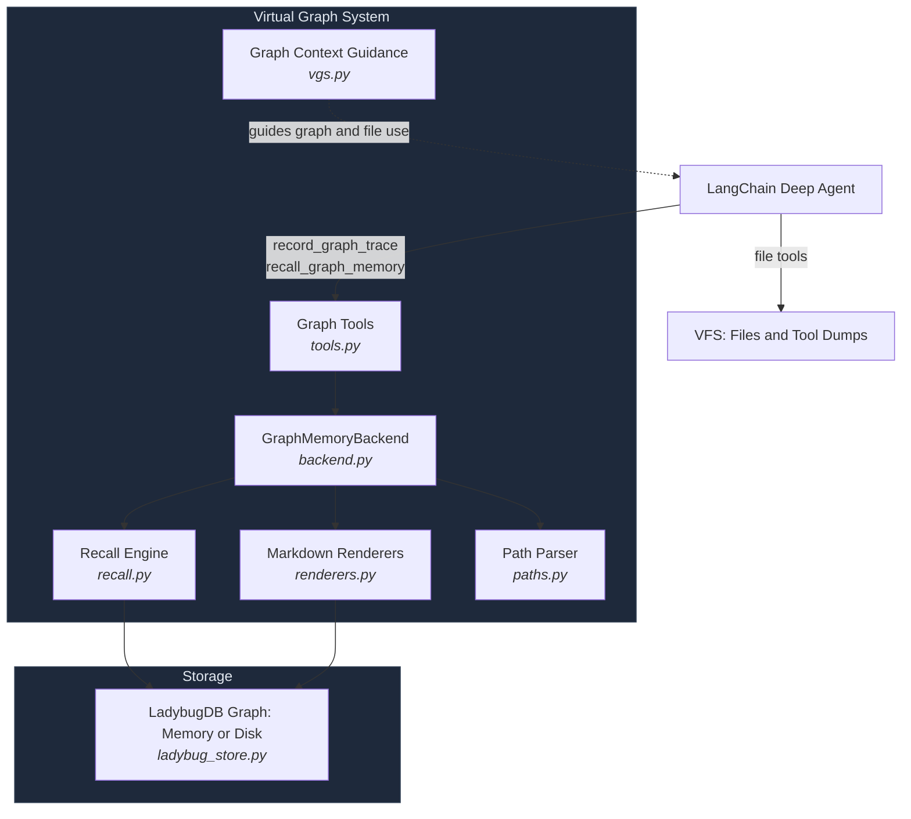
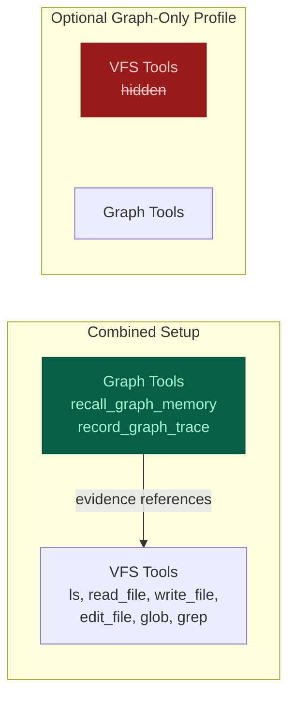
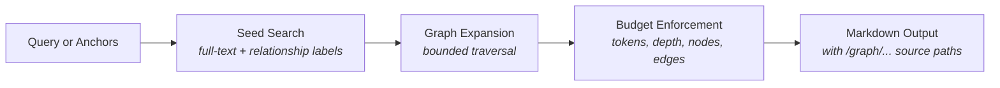

# deepagents-graph-memory

An experimental graph-backed workflow and trace store for LangChain Deep Agents. It records linked project context in LadybugDB, supports keyword search and bounded traversal, and exposes read-only Markdown views for inspection.

The [workflow evaluation](evals/README.md) runs twelve offline integration scenarios and offers an opt-in, bounded graph-versus-notes model comparison. Offline passes verify retrieval mechanics, not improved model decisions.

**Debugging a missing graph fact?** See [Inspecting the graph](#inspecting-the-graph) for a copyable Python example that needs no model or provider key.

[](https://github.com/TahaK29/deepagents-graph-memory)
[](https://python.org)
[](https://ladybugdb.com)
[](https://python.langchain.com)
[](https://opensource.org/licenses/MIT)

<p align="center">
  
</p>

## Motivation

Neo4j's [context graph article](https://neo4j.com/blog/genai/from-recall-to-reasoning-how-context-graphs-upgrade-an-agents-brain/) inspired this project. The package records supplied situations, rationales, actions, outcomes, artifacts, and links so agents can retrieve connected work context. It does not verify causal claims, infer new relationships, transfer knowledge automatically, or unlearn outdated facts. A rationale or causal label is an assertion supplied by the caller.

## What It Does

| Structured Traces | Graph Recall | Virtual Graph Views |
|---|---|---|
| Situation &rarr; Rationale &rarr; Action &rarr; Outcome | Keyword search + bounded traversal | Read-only `/graph/...` markdown projections |
| Caller-supplied links and metadata | Anchor-based seed expansion | Schema, index, node, search |
| Workflow and project context | Approximate output sizing plus depth, node, and edge limits | Inspectable through backend methods |

This is **not** ordinary user memory. Don't use it for facts like "the user likes ice cream." Use it for connected work state like *"this failing test led to this hypothesis, this edit, this result, and this final decision."*

The namespace option scopes graph data; it is not an authorization boundary, and schema inspection remains database-wide. `GraphMemoryBackend.create()` uses in-memory LadybugDB by default. Its data remains available while the backend/store is open and disappears when it closes or the process exits; there is no automatic cleanup after each agent invocation. Supply a filesystem `path` for [persistent storage](#persistent-storage).

### Sharing one graph between agents

Create one store and pass it to each backend. Use the same project namespace so both writers can inspect the same graph. Agent and subagent IDs are supplied by the caller; they are not inferred from the agent runtime.

```python
from deepagents_graph_memory import GraphMemoryBackend, graph_memory_tools, make_graph_subject
from deepagents_graph_memory.ladybug_store import LadybugGraphStore

store = LadybugGraphStore.memory()
parent = GraphMemoryBackend(store, namespace=("project", "demo"))
subagent = GraphMemoryBackend(store, namespace=("project", "demo"))
subject = make_graph_subject("src/parser.py", "empty-field parsing", "linux")
# Give the same subject to each worker when creating its tools.
worker_record = next(tool for tool in graph_memory_tools(subagent, bound_subject=subject) if tool.name == "record_graph_trace")

parent.record_graph_trace(
    situation="test failed at revision a1", rationale="the parser missed an empty field",
    action="asked a subagent to inspect the parser", outcome="cause identified",
    run_id="run-1", agent_id="parent", subject=subject,
)
worker_record.invoke({
    "situation": "parser skipped an empty field at revision a1", "rationale": "split removed the field",
    "action": "patched the parser", "outcome": "test passed at revision b2",
    "artifacts": ["src/parser.py"], "run_id": "run-1", "agent_id": "parent", "subagent_id": "parser-debugger",
})  # The binding supplies subject even though this call omits it.
print(parent.ls("/graph/nodes/Trace/").entries)
print(parent.read("/graph/search/parser.md").file_data["content"])
```

Writes through one store are serialized and each trace or document batch commits atomically. Existing node and edge properties survive updates that omit them; the last successful writer wins when writers set the same property. Shared Artifact and Evidence values retain links to every trace, with per-trace IDs on the links. Distinct in-memory stores do not share data. For a persistent graph, create one backend with `path=...` and pass its `.store` to other backends in the same process. Close the shared store only after all agents finish using it.

## Quick Start

```bash
pip install deepagents-graph-memory
```

Complete the one-time [full-text search setup](#full-text-search-setup) before
running graph search or recall.

```python
from deepagents import create_deep_agent
from deepagents.backends import CompositeBackend, StateBackend
from deepagents_graph_memory import (
    GraphMemoryBackend,
    graph_context_middleware,
    graph_memory_tools,
)

MODEL = "google_genai:gemini-3.5-flash"

# In-memory LadybugDB graph; no database path required
graph_backend = GraphMemoryBackend.create()
graph_tools = graph_memory_tools(graph_backend)

agent = create_deep_agent(
    model=MODEL,
    tools=graph_tools,
    middleware=[graph_context_middleware()],
    memory=["/graph/index.md", "/graph/schema.md"],
    backend=CompositeBackend(
        default=StateBackend(),  # Working files and offloaded tool results.
        routes={"/graph/": graph_backend},  # Read-only graph inspection.
    ),
    subagents=[{
        # Configure the default worker explicitly so it also gets graph guidance.
        "name": "general-purpose",
        "description": "Investigate a focused task and return findings with evidence.",
        "system_prompt": "Complete the assigned task and report findings with source paths.",
        "tools": graph_tools,
        "middleware": [graph_context_middleware()],
    }],
)
```

Configure the selected model provider integration and credentials separately. The no-provider-key example below only exercises backend inspection.

## Using VGS and VFS Together

Keep filesystem tools available for files, scratch work, and full tool output.
Use the graph to connect meaningful findings, failed attempts, decisions, and
outcomes to their evidence. A test log belongs in VFS; a trace can record what
failed, what changed, and which test run supports the result.

`graph_context_middleware()` adds this guidance to one agent without changing
model-wide profiles or removing filesystem instructions. Pass graph tools
explicitly. Add the middleware and graph tools to each subagent that needs them;
parent middleware does not automatically propagate to every subagent. The quick
start overrides the built-in general-purpose worker for this reason. Precompiled
or remote agents need their own setup and access to the evidence they cite.

The first lookup depends on the task: read a known file directly for a file edit,
or recall earlier attempts and dependencies when resuming work. Verify current
files or tool results before relying on historical findings. Record selective
outcomes rather than mirroring every read, file, or log line into the graph.

Deep Agents' existing filesystem middleware can offload large tool responses
under `/large_tool_results/`. Keep that location on a writable VFS backend so the
agent can use `read_file` and `grep` to inspect the dump. This package does not
change the offload threshold or copy the full dump into LadybugDB. When recording a
finding, use `evidence_refs` to cite the actual saved location and source identity,
including the revision or observation time when known.

Save captured evidence before recording a claim about it. File and graph writes
are separate operations: if trace recording fails after an action succeeded,
retry the recording with its operation ID rather than repeating the action.
Missing, inaccessible, or changed evidence cannot verify the original finding.
The middleware provides agent guidance; it does not fetch sources or enforce
atomic writes across VFS and LadybugDB.

You can keep your existing filesystem backend and add only the graph tools and
middleware. Mounting `/graph/` through the native `CompositeBackend` is optional;
it enables read-only file inspection of graph views. `write_file`, `edit_file`,
and uploads cannot mutate those views. Keep the physical LadybugDB database outside
the agent's writable file workspace. Ordinary preferences, instructions, and
notes remain in VFS or `/memories/`.

**Storage lifetimes are separate.** `StateBackend` uses thread state; retaining
those files across process restarts requires a durable checkpointer. Saving LadybugDB
with `path=...` does not persist VFS files. For evidence that must survive across
threads or deployments, configure a suitable persistent file/store backend and
give readers access to it. Do not assume a saved graph makes an old dump available.

## Persistent Storage

Persistence works through the Python library API in scripts, notebooks, agent
runners, background workers, or web applications. It does not depend on a web
framework or cloud provider. The application opens one store, passes it to its
agents, and closes it after they finish.

Pass a `str` or `pathlib.Path` to create or reopen a LadybugDB database file. The parent
directory must already exist; the package does not create directories or mount
storage. Examples use `.lbdb`; the path accepts any extension. Omitting `path`,
or passing `None`, keeps the default in-memory behavior.

This example writes a trace, closes the database, and reopens it without an LLM:

```python
from pathlib import Path
from tempfile import TemporaryDirectory

from deepagents_graph_memory import GraphMemoryBackend

with TemporaryDirectory() as directory:  # Use a durable directory in your app.
    path = Path(directory) / "project.lbdb"
    graph = GraphMemoryBackend.create(path=path, namespace=("project", "demo"))
    try:
        trace_id = graph.record_graph_trace(
            situation="parser test failed", rationale="empty field was dropped",
            action="fixed the parser", outcome="test passed",
        )
    finally:
        graph.close()

    reopened = GraphMemoryBackend.create(path=path, namespace=("project", "demo"))
    try:
        print(reopened.read(f"/graph/nodes/Trace/{trace_id}.md").file_data["content"])
    finally:
        reopened.close()
```

Successful writes commit during execution. `close()` releases the connection and
database lock; it does not delete a disk database. Calling it again is safe.
Backends sharing one store share its lifetime, so closing any of them closes that
store for all of them. Keep the database open across requests and close it during
application shutdown. Do not close it inside an active transaction.

Invalid paths and open failures raise errors instead of falling back to memory.
The path names a database file, not a directory or a URL such as `s3://...`.
Keep its containing directory on durable storage, including LadybugDB's associated
files. Reuse the same namespace when resuming the same project.

### Existing Kuzu databases

LadybugDB 0.20.3 rejects Kuzu 0.11.3 database files. Changing `.kuzu` to `.lbdb`
does not convert the format. Stop the old database owner and back up its database
and associated files before migration; keep that backup until verification ends.

Export using a separate environment with `kuzu==0.11.3` installed. Replace these
example paths with your source file and a new export directory:

```python
import kuzu

with kuzu.Database("/data/project.kuzu", read_only=True) as database:
    with kuzu.Connection(database) as connection:
        connection.execute("EXPORT DATABASE '/data/project-export';").close()
```

In the LadybugDB environment, complete [FTS setup](#full-text-search-setup), then
import into a new, empty database. Use the native default memory configuration
for this import; a 64 MiB buffer failed in the migration probe.

```python
import ssl  # Preload CPython OpenSSL libraries for the Windows native binding.
from pathlib import Path

import ladybug

new_path = Path("/data/project.lbdb")
if new_path.exists():
    raise FileExistsError(f"Choose a new database path: {new_path}")

with ladybug.Database(str(new_path)) as database:
    with ladybug.Connection(database) as connection:
        connection.execute("LOAD fts;").close()
        connection.execute("IMPORT DATABASE '/data/project-export';").close()
```

Import does not roll back all changes on failure. Keep the original untouched;
if an import fails, retry with another fresh target after fixing the cause.
Before pointing your application at the new file, compare node and relationship
counts, properties and provenance, namespace-scoped reads, and representative
search and recall results. Keep using the same application namespace.

### FastAPI and containers

FastAPI is one lifecycle example; other applications use the same `create(path=...)`
and `close()` calls in their own startup and shutdown code.

Configure your deployment to mount durable storage at `/data`, then open the
database once in FastAPI's lifespan. FastAPI is an application dependency; this
package does not install it.

```python
from contextlib import asynccontextmanager

from fastapi import FastAPI
from deepagents_graph_memory import GraphMemoryBackend


@asynccontextmanager
async def lifespan(app: FastAPI):
    graph = GraphMemoryBackend.create(
        path="/data/project.lbdb", namespace=("project", "demo"),
    )
    app.state.graph = graph
    try:
        yield
    finally:
        graph.close()


app = FastAPI(lifespan=lifespan)
# Use app.state.graph when constructing agents in your request handlers.
```

Use one worker process per writable database, for example
`uvicorn app:app --workers 1`. Parent and subagents in that process reuse the
store. A replacement container must open the same mounted database after the old
process releases it; rolling deployments must not overlap database owners. A
single replica setting alone does not prevent overlap during replacement.

The developer configures the volume, permissions, and retention across container
replacement. An ordinary container filesystem is not durable. The package accepts
a filesystem path and has no cloud SDKs, blob uploads, or automatic LangSmith
storage integration. It cannot detect whether your mount survives redeployment.

[Azure Container Apps storage mounts](https://learn.microsoft.com/en-us/azure/container-apps/storage-mounts)
and [AWS ECS EFS volumes](https://docs.aws.amazon.com/AmazonECS/latest/developerguide/efs-volumes.html)
describe provider setup. These links are not a claim of tested LadybugDB compatibility:
network filesystems must support LadybugDB's locking and file operations, and need
deployment-specific recovery tests. Local filesystem persistence is covered by
this package's tests; Azure Files and EFS have not been integration-tested here.

## How It Works

### Graph Traces

`record_graph_trace` records the core reasoning shape:

```
Situation -> Rationale -> Action -> Outcome
```

For example:

```
Situation: "sheep saw lion"
Rationale: "lion is dangerous"
Action:    "sheep ran away"
Outcome:   "sheep survived"
```

The graph stores edges like:

```
sheep saw lion --LED_TO--> lion is dangerous
lion is dangerous --JUSTIFIED--> sheep ran away
sheep ran away --PRODUCED--> sheep survived
```

Related findings can share a narrow `subject` within a namespace. Create it once
with `make_graph_subject(entity, aspect, environment)` and pass it to workers with
`graph_memory_tools(backend, bound_subject=subject)`. A worker may omit `subject`
when recording a trace; a different explicit subject is rejected. Keep changing
revisions in the trace context or evidence, and use separate subjects for environments
whose states should not be compared as one question. `observed_at` is
the time of the observation, while server-generated `recorded_at` is when the trace
was saved. A caller may explicitly supersede an earlier **state** finding only
with evidence and a strictly newer observation. The old trace and parallel newer
findings remain in the graph; explanations are never superseded by this rule.
For a reviewed disagreement between two or more same-subject traces, an evidenced
resolution trace can use `resolves=[...]`. Recall places that resolution ahead of
the reviewed originals and links them; this records a caller judgment, not a
database check of its truth.

```python
from deepagents_graph_memory import GraphMemoryBackend
from deepagents_graph_memory.errors import GraphMemoryValidationError

graph = GraphMemoryBackend.create()
common = dict(subject="tests/test_parser.py::test_empty@linux", finding_type="state")
graph.record_graph_trace(
    trace_id="failed", situation="parser test at revision a1", rationale="pytest exit 1",
    action="ran pytest", outcome="failed", evidence=["pytest output at a1: failed"],
    observed_at="2026-09-19T10:00:00Z", **common,
)
graph.record_graph_trace(
    trace_id="passed", situation="parser test at revision b2", rationale="pytest exit 0",
    action="reran pytest", outcome="passed", evidence=["pytest output at b2: passed"],
    observed_at="2026-09-19T11:00:00Z", supersedes=["failed"], **common,
)
try:
    graph.record_graph_trace(
        trace_id="delayed", situation="late report from revision a1", rationale="old output",
        action="reported result", outcome="failed", evidence=["pytest output at a1: failed"],
        observed_at="2026-09-19T09:30:00Z", supersedes=["passed"], **common,
    )
except GraphMemoryValidationError:
    pass  # An older observation cannot supersede the newer one.
print(graph.recall_graph_memory("failed", anchors=["/graph/nodes/Trace/failed.md"], max_nodes=2))
```

The caller supplies the subject and supersession assertion. Graph storage does not
detect contradictions, verify the evidence, or gate external actions. Recall brings
same-subject findings together when budgets permit and flags incomplete context;
the reading agent must compare and verify material disagreements before deciding.
It ranks a single subject's terminal findings and resolutions before applying the
node limit, using observation time for order when present. Competing branches stay
visible when the budget fits them. A partial history is labeled incomplete, and
an omitted anchor gets a direct path to inspect. This currently scans one subject's
traces during recall, so very large subjects may cost more to read.

Structured `evidence_refs` identify captured sources across reports. The caller
assigns a distinct `source_id` to each actual execution or snapshot at collection;
`locator` points to its log, file, or document. Reusing that ID cites the same
source, while changing its locator, revision, or observation time raises an error.
Optional `summary` describes a reporter's reading and belongs to that citation.
Plain `evidence` strings still work, but are unstructured caller reports. Neither
kind of evidence is fetched or verified by the graph. Distinct cited sources are
not necessarily independent experiments, and partial recall cannot establish a
complete source count.

```python
from deepagents_graph_memory import GraphMemoryBackend

graph = GraphMemoryBackend.create()
ref = {
    "source_id": "pytest-run-17", "locator": "logs/pytest-run-17.txt",
    "revision": "commit-a1", "observed_at": "2026-09-19T10:00:00Z",
}
for agent, summary in [("worker-a", "empty input failed"), ("worker-b", "parser failed")]:
    graph.record_graph_trace(
        situation="parser check", rationale="read pytest output", action="reported result",
        outcome="failed", subject="parser@linux", agent_id=agent,
        evidence_refs=[{**ref, "summary": summary}],
    )
print(graph.recall_graph_memory("parser@linux", max_nodes=3))
```

Conclusions can cite prior Trace IDs with `depends_on`. The targets must already
exist in the same namespace. Recall follows these links within its node, edge,
and depth budgets. If a cited finding is explicitly superseded or reviewed in a
resolution, recall marks the dependent conclusion `needs recheck` and shows the
changed premise's update path. This also applies through a chain of dependencies.
It flags review; it does not prove the decision false or change the original trace.
Missing evidence, cycles, or an incomplete dependency traversal produce an
unknown-status warning. A fresh conclusion should cite the current findings it
actually used.

```python
from deepagents_graph_memory import GraphMemoryBackend

graph = GraphMemoryBackend.create()
graph.record_graph_trace(
    trace_id="probe-failed", situation="checkout probe", rationale="run 1",
    action="tested checkout", outcome="failed", subject="checkout@staging",
    finding_type="state", observed_at="2026-09-19T10:00:00Z", evidence=["run 1 log"],
)
graph.record_graph_trace(
    trace_id="mitigation", situation="checkout failed", rationale="probe-failed",
    action="chose temporary mitigation", outcome="disable checkout",
    depends_on=["probe-failed"],
)
graph.record_graph_trace(
    trace_id="probe-passed", situation="checkout probe", rationale="run 2",
    action="tested checkout", outcome="passed", subject="checkout@staging",
    finding_type="state", observed_at="2026-09-19T11:00:00Z", evidence=["run 2 log"],
    supersedes=["probe-failed"],
)
context = graph.recall_graph_memory("mitigation", anchors=["/graph/nodes/Trace/mitigation.md"])
assert "needs recheck" in context
```

Use `operation_id` when retrying the same trace write. Replaying the same request
returns its original trace ID without changing the graph; changing the normalized
request under that ID raises `GraphMemoryValidationError`. A new execution needs a
new ID, even if its text is identical. The identity is scoped to the backend
namespace, and `operation_id` cannot be combined with `trace_id`.

```python
from deepagents_graph_memory import GraphMemoryBackend

graph = GraphMemoryBackend.create()
payload = dict(situation="network timeout", rationale="probe failed", action="checked network", outcome="unavailable")
first = graph.record_graph_trace(operation_id="network-probe-7", **payload)
assert graph.record_graph_trace(operation_id="network-probe-7", **payload) == first
assert graph.record_graph_trace(operation_id="network-probe-8", **payload) != first
```

The `record_graph_trace` tool uses its injected tool-call ID and runtime thread ID
for retries when no explicit `operation_id` is supplied. Direct calls without
either ID continue to append traces.

Writes are issued as LadybugDB Cypher `MERGE` statements (no raw Cypher is exposed to the agent).

### Graph Recall

`recall_graph_memory` searches for seed facts, expands through useful edges, and returns compact markdown with source `/graph/...` paths. Pass anchors (file paths, run IDs, task IDs) to give recall a concrete starting point.

Matching generated trace components and paths are summarized once in recall. Explicit component anchors, custom nodes with different content, and direct `/graph/...` debug views remain available.

Recall uses LadybugDB keyword search to find seed nodes, then bounded Cypher `MATCH` traversal to expand connected context. The token budget estimates output size; it is not an exact token cap. No vector/embedding search is used.

```python
graph_backend.recall_graph_memory("what services did incident 123 affect and what do they depend on?")
```

## Graph Tools

```python
graph_memory_tools(graph_backend)
```

| Tool | Purpose |
|---|---|
| `recall_graph_memory` | Primary read path -- search, expand, return context |
| `record_graph_trace` | High-level write -- Situation &rarr; Rationale &rarr; Action &rarr; Outcome |

Low-level write tools are available for application builders but not exposed by default, since unconstrained agents can create drifting labels and relationship types:

```python
graph_memory_tools(graph_backend, include_low_level_writes=True)
```

| Tool | Purpose |
|---|---|
| `add_graph_node` | Create or update entities |
| `add_graph_edge` | Create or update relationships |
| `add_graph_documents` | Ingest LangChain documents |

For production use, prefer domain-specific tools that call `graph_backend.add_graph_node(...)` and `graph_backend.add_graph_edge(...)` with your application's approved labels and relationships.

## Virtual Graph Views

The backend projects graph state into read-only markdown paths:

| Path | Description |
|---|---|
| `/graph/schema.md` | Current graph schema |
| `/graph/index.md` | Graph memory landing page |
| `/graph/nodes/{label}/{id}.md` | Single node with properties and relationships |
| `/graph/search/{query}.md` | Search results with preview text |

These are generated virtual paths, not files on disk or browser links. Node pages include stored properties, provenance when present, and bounded one-hop relationships. Writes go through graph tools, not file operations.

### Inspecting the graph

Use backend methods to check a recorded fact directly, even when recall does not select it. This example runs locally without an LLM or provider key:

```python
from deepagents_graph_memory import GraphMemoryBackend

backend = GraphMemoryBackend.create()
trace_id = backend.record_graph_trace(
    trace_id="debug-trace-1",
    situation="scope test failed",
    rationale="a graph read might use the wrong scope",
    action="checked the read path",
    outcome="scope test passed",
    source="tests/test_scope.py",
)

print(trace_id)
print([entry["path"] for entry in backend.ls("/graph/nodes/Trace/").entries])
node_path = f"/graph/nodes/Trace/{trace_id}.md"
node = backend.read(node_path)
if node.error:
    raise RuntimeError(node.error)
print(node.file_data["content"])
print(backend.read("/graph/schema.md").file_data["content"])
print(backend.read("/graph/search/scope.md").file_data["content"])
```

For a missing answer, read the exact known node path first. A "not found" error means that node is absent from the active scope; a returned page lets you inspect its text, provenance, and relationships. Then try `backend.recall_graph_memory("scope test", anchors=[node_path])` to start recall at that node. `ls()` helps discover paths, but its output is bounded by `max_nodes`, so an absent listing entry does not prove absence; increase `max_nodes` if needed. Inspection bypasses recall's relevance selection, while node relationships still obey `max_nodes` and `max_edges`. `read()` also accepts line `offset` and `limit`.

## Optional Graph-Only Mode

For applications that deliberately omit filesystem tools, the existing
`register_vgs_harness_profile(model)` helper enables graph-only behavior:

- Deep Agents default VFS tools are hidden: `ls`, `read_file`, `write_file`, `edit_file`, `glob`, `grep`
- VGS prompt guidance is added
- The caller passes `graph_memory_tools(graph_backend)` explicitly; the profile does not install them

With file tools hidden, agents use `recall_graph_memory`, which queries the graph store directly. `memory=["/graph/index.md", "/graph/schema.md"]` loads those two views into agent context; it does not enable interactive graph browsing. Developers can still inspect through `GraphMemoryBackend.ls()`, `read()`, `glob()`, and `grep()`.

Use the combined setup above when the agent needs files or offloaded tool output.
The graph-only helper changes the profile for a model key throughout the process;
do not register it for a model used by combined-mode agents. Adding
`graph_context_middleware()` does not undo an existing tool exclusion. Graph tools
remain opt-in for ordinary Deep Agents applications.

## Architecture

### System Overview



### Combined and Graph-Only Setups



### Recall Pipeline



### Trace Data Model


### Module Reference

| Component | Module | Description |
|---|---|---|
| **Backend** | `backend.py` | `BackendProtocol` implementation for Deep Agents |
| **Graph Store** | `ladybug_store.py` | LadybugDB adapter with FTS indexing and scoped queries |
| **Recall Engine** | `recall.py` | Seed search &rarr; expansion &rarr; budget enforcement &rarr; markdown output |
| **Tools** | `tools.py` | LangChain tools with error boundaries |
| **Renderers** | `renderers.py` | Graph data &rarr; markdown view projections |
| **Paths** | `paths.py` | Virtual path parsing and validation |
| **Graph Guidance** | `vgs.py` | Agent-local combined guidance and optional graph-only profiles |
| **Errors** | `errors.py` | `GraphMemoryError`, `GraphMemoryConfigurationError`, `GraphMemoryPathError`, `GraphMemoryValidationError` |

## Example Domain: SRE

VGS is domain-agnostic; here is one example of how a project might shape its labels and relationships:

```
Langfuse DEPENDS_ON Redis
Langfuse DEPENDS_ON Postgres
SRE Team OWNS Langfuse
Incident 123 AFFECTED Langfuse
Incident 123 RESOLVED_BY "Restart Ingestion Workers" Runbook
```

Recall query:
```python
graph_backend.recall_graph_memory("what services did incident 123 affect and what do they depend on?")
```

## Installation

```bash
pip install deepagents-graph-memory           # Core (includes LadybugDB + LangChain)
pip install deepagents-graph-memory[test]      # + pytest, ruff
```

### Full-text search setup

LadybugDB 0.20.3 requires a separately installed `fts` extension for graph search
and recall. A fresh `pip install` does not provide it. Run this once during
development setup or your image build with network access, following the
[official extension installation](https://docs.ladybugdb.com/extensions/#install-an-extension):

```python
import ssl  # Preload CPython OpenSSL libraries for the Windows native binding.

import ladybug

with ladybug.Database(":memory:", buffer_pool_size=64 * 1024 * 1024) as database:
    with ladybug.Connection(database) as connection:
        connection.execute("INSTALL fts;").close()
        connection.execute("LOAD fts;").close()
```

Provision for the same LadybugDB version, OS, architecture, and runtime user.
Keep the installed extension cache available in the runtime image or volume;
building as a different user does not make that user's cache available to your
application. After provisioning, runtime search loads the local extension.
The adapter does not download extensions or fall back to another search method;
a missing extension raises a configuration error.

### Requirements

- Python 3.11–3.14 (`>=3.11,<3.15`)
- Deep Agents 0.5.2+
- LadybugDB via `ladybug==0.20.3`

The exact pin excludes the Windows FTS ABI regression in 0.20.4 reported in
[upstream issue #971](https://github.com/LadybugDB/ladybug/issues/971).

The [Ladybug 0.20.3 wheels](https://pypi.org/project/ladybug/0.20.3/#files)
include macOS 15+ (Intel and Apple Silicon), Linux, and Windows builds for
x86-64 and ARM64. Check the available wheel for your Python version, architecture,
and OS; wheel availability does not establish that this package passed tests on
every combination.

## Development

```bash
git clone https://github.com/TahaK29/deepagents-graph-memory.git
cd deepagents-graph-memory
pip install -e ".[test]"
python3 -m pytest -q                          # Run all tests
python3 -m ruff check .                       # Lint
```

## Design

`GraphMemoryBackend.create()` creates a LadybugDB in-memory graph via `ladybug.Database(":memory:")`. Supply `path=...` to create or reopen a disk database. Persistence depends on retaining that filesystem across restarts; each writable database has one owning process. Both modes use the same graph tools and namespace rules.

Recall uses full-text search to find seed nodes, relationship-label search for relationship-oriented questions, and bounded graph traversal to recover connected context. Vector search and graph algorithms are intentionally not part of the default recall path.

Raw Cypher is not exposed as an agent-facing read or write path. Generated graph views are read-only projections.

For the full design rationale, see [DESIGN.md](DESIGN.md).

## License

MIT

---

**deepagents-graph-memory** is experimental. [GitHub Issues](https://github.com/TahaK29/deepagents-graph-memory/issues) 
