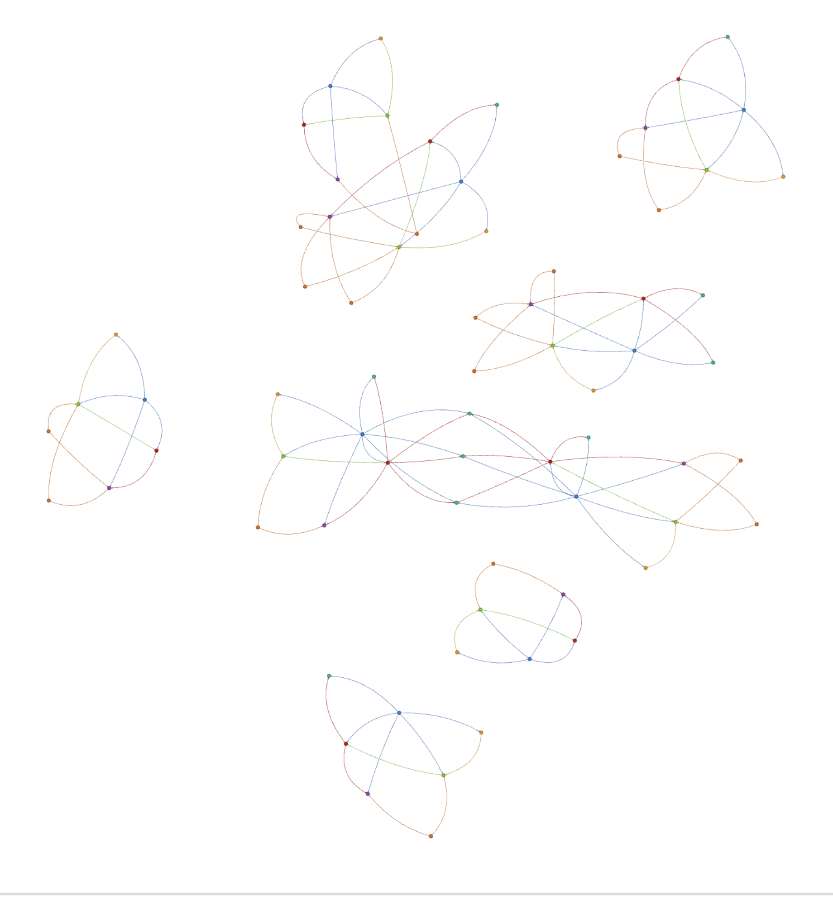
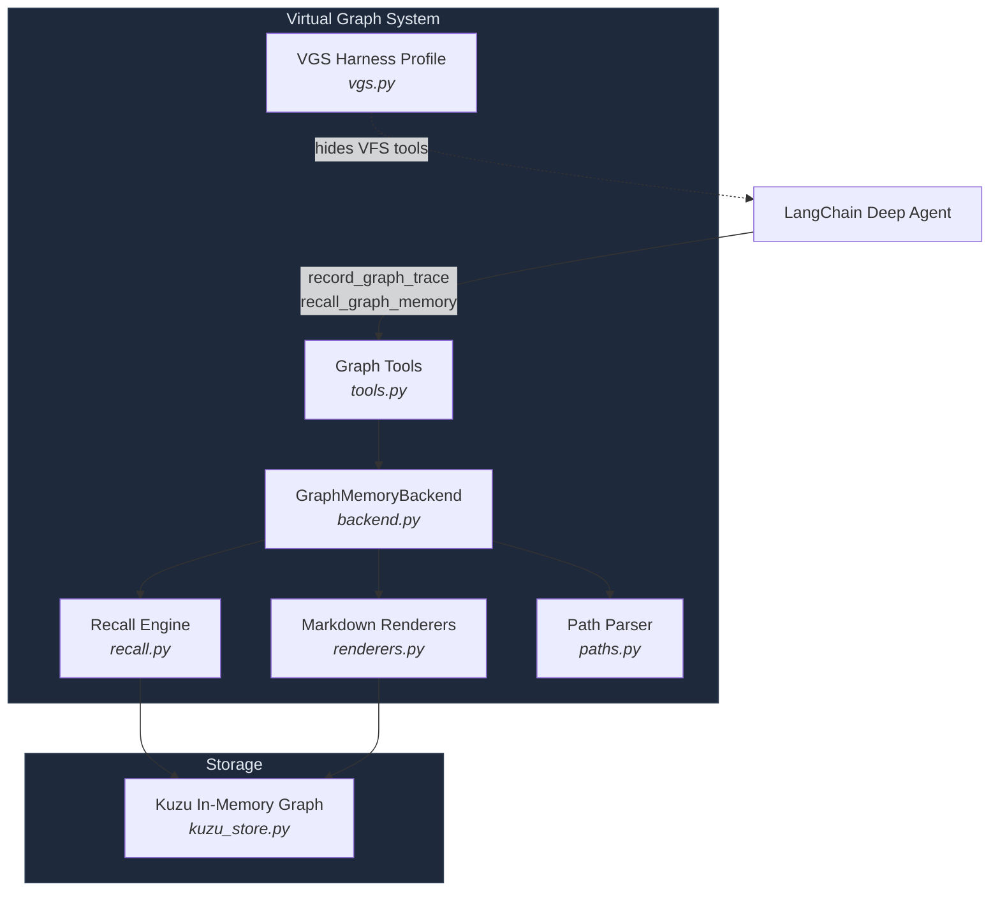
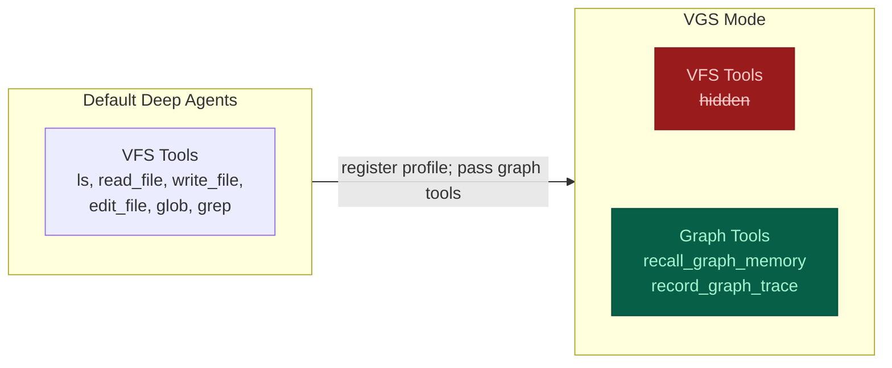
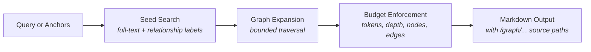

# deepagents-graph-memory

An experimental graph-backed workflow and trace store for LangChain Deep Agents. It records linked project context in Kuzu, supports keyword search and bounded traversal, and exposes read-only Markdown views for inspection.

**Debugging a missing graph fact?** See [Inspecting the graph](#inspecting-the-graph) for a copyable Python example that needs no model or provider key.

[](https://github.com/TahaK29/deepagents-graph-memory)
[](https://python.org)
[](https://kuzudb.com)
[](https://python.langchain.com)
[](https://opensource.org/licenses/MIT)

<p align="center">
  
</p>

## Motivation

Neo4j's [context graph article](https://neo4j.com/blog/genai/from-recall-to-reasoning-how-context-graphs-upgrade-an-agents-brain/) inspired this project. The package records supplied situations, rationales, actions, outcomes, artifacts, and links so agents can retrieve connected work context. It does not verify causal claims, infer new relationships, transfer knowledge automatically, or unlearn outdated facts. A rationale or causal label is an assertion supplied by the caller.

## What It Does

| Structured Traces | Graph Recall | Virtual Graph Views |
|---|---|---|
| Situation &rarr; Rationale &rarr; Action &rarr; Outcome | Keyword search + bounded traversal | Read-only `/graph/...` markdown projections |
| Caller-supplied links and metadata | Anchor-based seed expansion | Schema, index, node, search |
| Workflow and project context | Approximate output sizing plus depth, node, and edge limits | Inspectable through backend methods |

This is **not** ordinary user memory. Don't use it for facts like "the user likes ice cream." Use it for connected work state like *"this failing test led to this hypothesis, this edit, this result, and this final decision."*

The namespace option scopes graph data; it is not an authorization boundary, and schema inspection remains database-wide. `GraphMemoryBackend.create()` uses in-memory Kuzu. Its data remains available while the backend/store is retained in the process and disappears when the process exits; there is no automatic cleanup after each agent invocation or disk persistence.

### Sharing one graph between agents

Create one store and pass it to each backend. Use the same project namespace so both writers can inspect the same graph. Agent and subagent IDs are supplied by the caller; they are not inferred from the agent runtime.

```python
from deepagents_graph_memory import GraphMemoryBackend, graph_memory_tools, make_graph_subject
from deepagents_graph_memory.kuzu_store import KuzuGraphStore

store = KuzuGraphStore.memory()
parent = GraphMemoryBackend(store, namespace=("project", "demo"))
subagent = GraphMemoryBackend(store, namespace=("project", "demo"))
subject = make_graph_subject("src/parser.py", "empty-field parsing", "linux")
# Give the same subject to each worker when creating its tools.
worker_record = next(tool for tool in graph_memory_tools(subagent, bound_subject=subject) if tool.name == "record_graph_trace")

parent.record_graph_trace(
    situation="test failed at revision a1", rationale="the parser missed an empty field",
    action="asked a subagent to inspect the parser", outcome="cause identified",
    run_id="run-1", agent_id="parent", subject=subject,
)
worker_record.invoke({
    "situation": "parser skipped an empty field at revision a1", "rationale": "split removed the field",
    "action": "patched the parser", "outcome": "test passed at revision b2",
    "artifacts": ["src/parser.py"], "run_id": "run-1", "agent_id": "parent", "subagent_id": "parser-debugger",
})  # The binding supplies subject even though this call omits it.
print(parent.ls("/graph/nodes/Trace/").entries)
print(parent.read("/graph/search/parser.md").file_data["content"])
```

Writes through one store are serialized and each trace or document batch commits atomically. Existing node and edge properties survive updates that omit them; the last successful writer wins when writers set the same property. Shared Artifact and Evidence values retain links to every trace, with per-trace IDs on the links. Distinct stores do not share data, and this in-memory store does not work across processes.

## Quick Start

```bash
pip install deepagents-graph-memory
```

```python
from deepagents import create_deep_agent
from deepagents_graph_memory import (
    GraphMemoryBackend,
    graph_memory_tools,
    register_vgs_harness_profile,
)

MODEL = "google_genai:gemini-3.5-flash"

# Hide default VFS tools and add graph prompt guidance
register_vgs_harness_profile(MODEL)

# In-memory Kuzu graph -- no disk, no config
graph_backend = GraphMemoryBackend.create()

agent = create_deep_agent(
    model=MODEL,
    tools=[*graph_memory_tools(graph_backend)],  # pass graph tools explicitly
    memory=["/graph/index.md", "/graph/schema.md"],
    backend=graph_backend,
)
```

Configure the selected model provider integration and credentials separately. The no-provider-key example below only exercises backend inspection.

## How It Works

### Graph Traces

`record_graph_trace` records the core reasoning shape:

```
Situation -> Rationale -> Action -> Outcome
```

For example:

```
Situation: "sheep saw lion"
Rationale: "lion is dangerous"
Action:    "sheep ran away"
Outcome:   "sheep survived"
```

The graph stores edges like:

```
sheep saw lion --LED_TO--> lion is dangerous
lion is dangerous --JUSTIFIED--> sheep ran away
sheep ran away --PRODUCED--> sheep survived
```

Related findings can share a narrow `subject` within a namespace. Create it once
with `make_graph_subject(entity, aspect, environment)` and pass it to workers with
`graph_memory_tools(backend, bound_subject=subject)`. A worker may omit `subject`
when recording a trace; a different explicit subject is rejected. Keep changing
revisions in the trace context or evidence, and use separate subjects for environments
whose states should not be compared as one question. `observed_at` is
the time of the observation, while server-generated `recorded_at` is when the trace
was saved. A caller may explicitly supersede an earlier **state** finding only
with evidence and a strictly newer observation. The old trace and parallel newer
findings remain in the graph; explanations are never superseded by this rule.
For a reviewed disagreement between two or more same-subject traces, an evidenced
resolution trace can use `resolves=[...]`. Recall places that resolution ahead of
the reviewed originals and links them; this records a caller judgment, not a
database check of its truth.

```python
from deepagents_graph_memory import GraphMemoryBackend
from deepagents_graph_memory.errors import GraphMemoryValidationError

graph = GraphMemoryBackend.create()
common = dict(subject="tests/test_parser.py::test_empty@linux", finding_type="state")
graph.record_graph_trace(
    trace_id="failed", situation="parser test at revision a1", rationale="pytest exit 1",
    action="ran pytest", outcome="failed", evidence=["pytest output at a1: failed"],
    observed_at="2026-09-19T10:00:00Z", **common,
)
graph.record_graph_trace(
    trace_id="passed", situation="parser test at revision b2", rationale="pytest exit 0",
    action="reran pytest", outcome="passed", evidence=["pytest output at b2: passed"],
    observed_at="2026-09-19T11:00:00Z", supersedes=["failed"], **common,
)
try:
    graph.record_graph_trace(
        trace_id="delayed", situation="late report from revision a1", rationale="old output",
        action="reported result", outcome="failed", evidence=["pytest output at a1: failed"],
        observed_at="2026-09-19T09:30:00Z", supersedes=["passed"], **common,
    )
except GraphMemoryValidationError:
    pass  # An older observation cannot supersede the newer one.
print(graph.recall_graph_memory("failed", anchors=["/graph/nodes/Trace/failed.md"], max_nodes=2))
```

The caller supplies the subject and supersession assertion. Graph storage does not
detect contradictions, verify the evidence, or gate external actions. Recall brings
same-subject findings together when budgets permit and flags incomplete context;
the reading agent must compare and verify material disagreements before deciding.
It ranks a single subject's terminal findings and resolutions before applying the
node limit, using observation time for order when present. Competing branches stay
visible when the budget fits them. A partial history is labeled incomplete, and
an omitted anchor gets a direct path to inspect. This currently scans one subject's
traces during recall, so very large subjects may cost more to read.

Conclusions can cite prior Trace IDs with `depends_on`. The targets must already
exist in the same namespace. Recall follows these links within its node, edge,
and depth budgets. If a cited finding is explicitly superseded or reviewed in a
resolution, recall marks the dependent conclusion `needs recheck` and shows the
changed premise's update path. This also applies through a chain of dependencies.
It flags review; it does not prove the decision false or change the original trace.
Missing evidence, cycles, or an incomplete dependency traversal produce an
unknown-status warning. A fresh conclusion should cite the current findings it
actually used.

```python
from deepagents_graph_memory import GraphMemoryBackend

graph = GraphMemoryBackend.create()
graph.record_graph_trace(
    trace_id="probe-failed", situation="checkout probe", rationale="run 1",
    action="tested checkout", outcome="failed", subject="checkout@staging",
    finding_type="state", observed_at="2026-09-19T10:00:00Z", evidence=["run 1 log"],
)
graph.record_graph_trace(
    trace_id="mitigation", situation="checkout failed", rationale="probe-failed",
    action="chose temporary mitigation", outcome="disable checkout",
    depends_on=["probe-failed"],
)
graph.record_graph_trace(
    trace_id="probe-passed", situation="checkout probe", rationale="run 2",
    action="tested checkout", outcome="passed", subject="checkout@staging",
    finding_type="state", observed_at="2026-09-19T11:00:00Z", evidence=["run 2 log"],
    supersedes=["probe-failed"],
)
context = graph.recall_graph_memory("mitigation", anchors=["/graph/nodes/Trace/mitigation.md"])
assert "needs recheck" in context
```

Use `operation_id` when retrying the same trace write. Replaying the same request
returns its original trace ID without changing the graph; changing any request
field under that ID raises `GraphMemoryValidationError`. A new execution needs a
new ID, even if its text is identical. The identity is scoped to the backend
namespace, and `operation_id` cannot be combined with `trace_id`.

```python
from deepagents_graph_memory import GraphMemoryBackend

graph = GraphMemoryBackend.create()
payload = dict(situation="network timeout", rationale="probe failed", action="checked network", outcome="unavailable")
first = graph.record_graph_trace(operation_id="network-probe-7", **payload)
assert graph.record_graph_trace(operation_id="network-probe-7", **payload) == first
assert graph.record_graph_trace(operation_id="network-probe-8", **payload) != first
```

The `record_graph_trace` tool uses its injected tool-call ID and runtime thread ID
for retries when no explicit `operation_id` is supplied. Direct calls without
either ID continue to append traces.

Writes are issued as Kuzu Cypher `MERGE` statements (no raw Cypher is exposed to the agent).

### Graph Recall

`recall_graph_memory` searches for seed facts, expands through useful edges, and returns compact markdown with source `/graph/...` paths. Pass anchors (file paths, run IDs, task IDs) to give recall a concrete starting point.

Recall uses Kuzu keyword search to find seed nodes, then bounded Cypher `MATCH` traversal to expand connected context. The token budget estimates output size; it is not an exact token cap. No vector/embedding search is used.

```python
graph_backend.recall_graph_memory("what services did incident 123 affect and what do they depend on?")
```

## Graph Tools

```python
graph_memory_tools(graph_backend)
```

| Tool | Purpose |
|---|---|
| `recall_graph_memory` | Primary read path -- search, expand, return context |
| `record_graph_trace` | High-level write -- Situation &rarr; Rationale &rarr; Action &rarr; Outcome |

Low-level write tools are available for application builders but not exposed by default, since unconstrained agents can create drifting labels and relationship types:

```python
graph_memory_tools(graph_backend, include_low_level_writes=True)
```

| Tool | Purpose |
|---|---|
| `add_graph_node` | Create or update entities |
| `add_graph_edge` | Create or update relationships |
| `add_graph_documents` | Ingest LangChain documents |

For production use, prefer domain-specific tools that call `graph_backend.add_graph_node(...)` and `graph_backend.add_graph_edge(...)` with your application's approved labels and relationships.

## Virtual Graph Views

The backend projects graph state into read-only markdown paths:

| Path | Description |
|---|---|
| `/graph/schema.md` | Current graph schema |
| `/graph/index.md` | Graph memory landing page |
| `/graph/nodes/{label}/{id}.md` | Single node with properties and relationships |
| `/graph/search/{query}.md` | Search results with preview text |

These are generated virtual paths, not files on disk or browser links. Node pages include stored properties, provenance when present, and bounded one-hop relationships. Writes go through graph tools, not file operations.

### Inspecting the graph

Use backend methods to check a recorded fact directly, even when recall does not select it. This example runs locally without an LLM or provider key:

```python
from deepagents_graph_memory import GraphMemoryBackend

backend = GraphMemoryBackend.create()
trace_id = backend.record_graph_trace(
    trace_id="debug-trace-1",
    situation="scope test failed",
    rationale="a graph read might use the wrong scope",
    action="checked the read path",
    outcome="scope test passed",
    source="tests/test_scope.py",
)

print(trace_id)
print([entry["path"] for entry in backend.ls("/graph/nodes/Trace/").entries])
node_path = f"/graph/nodes/Trace/{trace_id}.md"
node = backend.read(node_path)
if node.error:
    raise RuntimeError(node.error)
print(node.file_data["content"])
print(backend.read("/graph/schema.md").file_data["content"])
print(backend.read("/graph/search/scope.md").file_data["content"])
```

For a missing answer, read the exact known node path first. A "not found" error means that node is absent from the active scope; a returned page lets you inspect its text, provenance, and relationships. Then try `backend.recall_graph_memory("scope test", anchors=[node_path])` to start recall at that node. `ls()` helps discover paths, but its output is bounded by `max_nodes`, so an absent listing entry does not prove absence; increase `max_nodes` if needed. Inspection bypasses recall's relevance selection, while node relationships still obey `max_nodes` and `max_edges`. `read()` also accepts line `offset` and `limit`.

## VGS Mode

When VGS (Virtual Graph System) is enabled via `register_vgs_harness_profile`:

- Deep Agents default VFS tools are hidden: `ls`, `read_file`, `write_file`, `edit_file`, `glob`, `grep`
- VGS prompt guidance is added
- The caller passes `graph_memory_tools(graph_backend)` explicitly; the profile does not install them

With file tools hidden, agents use `recall_graph_memory`, which queries the graph store directly. `memory=["/graph/index.md", "/graph/schema.md"]` loads those two views into agent context; it does not enable interactive graph browsing. Developers can still inspect through `GraphMemoryBackend.ls()`, `read()`, `glob()`, and `grep()`.

VGS should be **off by default** in a normal Deep Agents install. Enable it only when graph-structured context is needed.

## Architecture

### System Overview



### Default vs VGS Mode



### Recall Pipeline



### Trace Data Model


### Module Reference

| Component | Module | Description |
|---|---|---|
| **Backend** | `backend.py` | `BackendProtocol` implementation for Deep Agents |
| **Graph Store** | `kuzu_store.py` | Kuzu adapter with FTS indexing and scoped queries |
| **Recall Engine** | `recall.py` | Seed search &rarr; expansion &rarr; budget enforcement &rarr; markdown output |
| **Tools** | `tools.py` | LangChain tools with error boundaries |
| **Renderers** | `renderers.py` | Graph data &rarr; markdown view projections |
| **Paths** | `paths.py` | Virtual path parsing and validation |
| **VGS Profile** | `vgs.py` | Harness profile helpers and prompt middleware |
| **Errors** | `errors.py` | `GraphMemoryError`, `GraphMemoryConfigurationError`, `GraphMemoryPathError`, `GraphMemoryValidationError` |

## Example Domain: SRE

VGS is domain-agnostic; here is one example of how a project might shape its labels and relationships:

```
Langfuse DEPENDS_ON Redis
Langfuse DEPENDS_ON Postgres
SRE Team OWNS Langfuse
Incident 123 AFFECTED Langfuse
Incident 123 RESOLVED_BY "Restart Ingestion Workers" Runbook
```

Recall query:
```python
graph_backend.recall_graph_memory("what services did incident 123 affect and what do they depend on?")
```

## Installation

```bash
pip install deepagents-graph-memory           # Core (includes Kuzu + LangChain)
pip install deepagents-graph-memory[test]      # + pytest, ruff
```

### Requirements

- Python 3.11+
- Deep Agents 0.5.2+
- Kuzu 0.11.3+

## Development

```bash
git clone https://github.com/TahaK29/deepagents-graph-memory.git
cd deepagents-graph-memory
pip install -e ".[test]"
python3 -m pytest -q                          # Run all tests
python3 -m ruff check .                       # Lint
```

## Design

`GraphMemoryBackend.create()` creates a Kuzu in-memory graph via `kuzu.Database(":memory:")`. Data lives in the Python process's RAM -- works on a laptop, VM, or container, but is lost on restart and not shared across workers.

Recall uses full-text search to find seed nodes, relationship-label search for relationship-oriented questions, and bounded graph traversal to recover connected context. Vector search and graph algorithms are intentionally not part of the default recall path.

Raw Cypher is not exposed as an agent-facing read or write path. Generated graph views are read-only projections.

For the full design rationale, see [DESIGN.md](DESIGN.md).

## License

MIT

---

**deepagents-graph-memory** is experimental. [GitHub Issues](https://github.com/TahaK29/deepagents-graph-memory/issues) 
