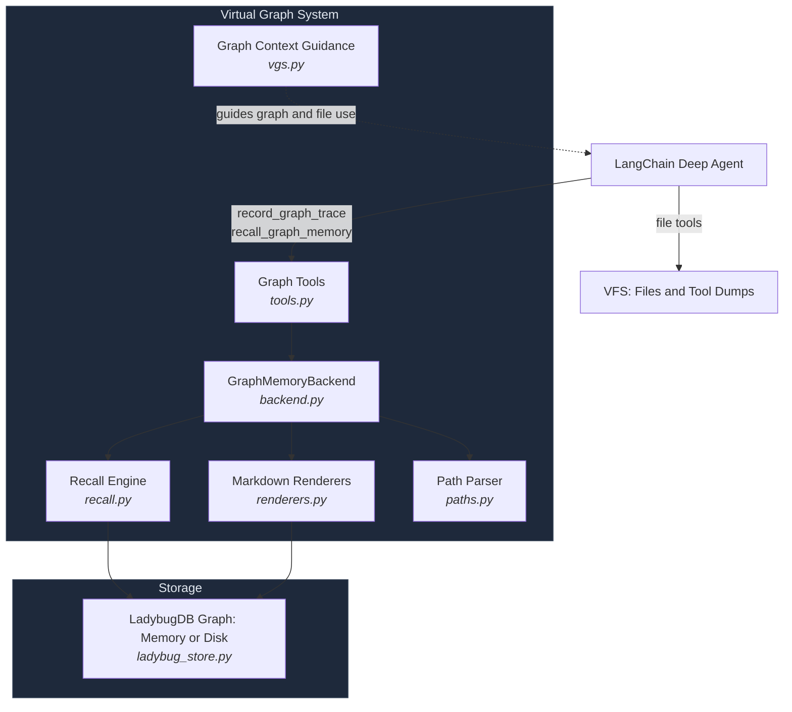
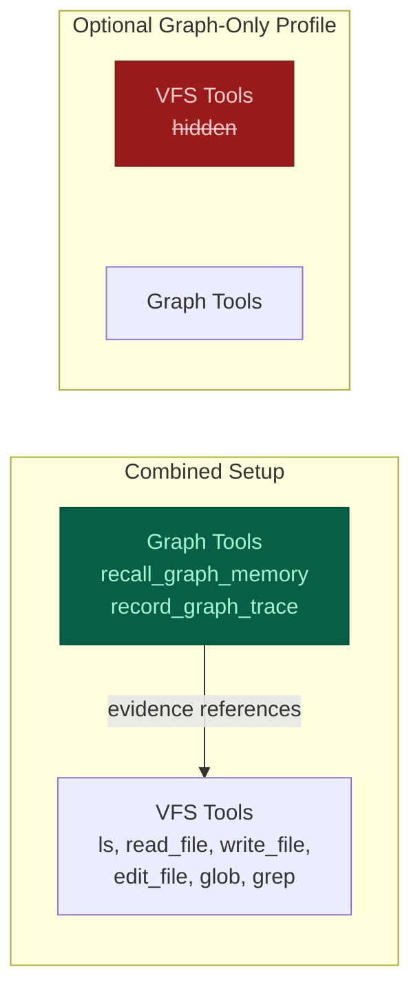
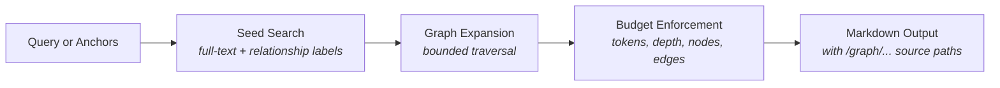

# Complete guide

[Back to the README](../README.md)

- [Installation and requirements](#installation)
- [Deep Agents quick start](#quick-start)
- [Sharing a graph between agents](#sharing-one-graph-between-agents)
- [Graph context, files, and tool dumps](#using-vgs-and-vfs-together)
- [Persistence and deployment](#persistent-storage)
- [Findings, evidence, supersession, and retries](#graph-traces)
- [Tools](#graph-tools) and [debugging](#inspecting-the-graph)
- [Graph-only mode](#optional-graph-only-mode)
- [Architecture](#architecture) and [design rationale](#design-rationale)
- [Development](#development) and [evaluations](#workflow-evaluation)
- [Publishing](#publishing-a-release) and [LangChain listing](#langchain-backend-listing)

## Installation

```bash
pip install --upgrade deepagents-graph-memory
```

Starting with 0.1.1, the published wheels include the pinned LadybugDB 0.20.3
runtime, its FTS extension, and OpenSSL shared libraries. Importing or searching
never downloads dependencies, installs system packages, or writes an extension
cache into the user's home directory.

### Requirements

- CPython 3.11–3.14, standard GIL builds.
- macOS 15+ on Apple Silicon or Intel; Windows x64; Linux x64 or ARM64 with glibc 2.28+.
- Deep Agents 0.6.10 or later. CI also checks 0.6.10, 0.6.12, and 0.7.1.

**Intel Mac limitation:** the graph wheel is self-contained, but the latest Deep
Agents dependency chain includes `cryptography`, which
[stopped publishing Intel Mac wheels in version 49](https://cryptography.io/en/latest/changelog/#v49-0-0).
Installing that dependency can require Rust, Xcode command-line tools, and OpenSSL
for a source build; see its [installation guide](https://cryptography.io/en/latest/installation/).
We do not cap it to an older release: version 50 includes a security fix missing
from the last Intel wheel release. Apple Silicon, Windows x64, and the supported
Linux targets have prebuilt wheels for the currently tested dependency versions.

PyPI releases provide platform wheels, not a source archive that silently falls
back to a native build. Windows ARM64, Alpine/musl, PyPy, and free-threaded Python
aren't in this wheel matrix. Unsupported platforms need a separately tested
source build. Future Deep Agents releases still need CI to establish compatibility.

The runtime stays pinned to 0.20.3 because 0.20.4 has a
[Windows FTS ABI regression](https://github.com/LadybugDB/ladybug/issues/971).
The package loads its private copy under Ladybug's canonical Python module name
to avoid loading the native binding twice. An already imported standalone
Ladybug 0.20.3 can be reused; a different loaded version raises an error. Keep
applications that need conflicting Ladybug versions in separate processes.

### Full-text search setup

**Published wheels need no setup.** Search loads the extension shipped inside the
package, including in offline containers. Install the wheel during your image
build and run it on the matching platform and Python version.

Only source/editable development needs the manual setup described below.

## Motivation

Neo4j's [context graph article](https://neo4j.com/blog/genai/from-recall-to-reasoning-how-context-graphs-upgrade-an-agents-brain/) inspired this project. The package records supplied situations, rationales, actions, outcomes, artifacts, and links so agents can retrieve connected work context. It does not verify causal claims, infer new relationships, transfer knowledge automatically, or unlearn outdated facts. A rationale or causal label is an assertion supplied by the caller.

## What It Does

| Structured Traces | Graph Recall | Virtual Graph Views |
|---|---|---|
| Situation &rarr; Rationale &rarr; Action &rarr; Outcome | Keyword search + bounded traversal | Read-only `/graph/...` markdown projections |
| Caller-supplied links and metadata | Anchor-based seed expansion | Schema, index, node, search |
| Workflow and project context | Approximate output sizing plus depth, node, and edge limits | Inspectable through backend methods |

This is **not** ordinary user memory. Don't use it for facts like "the user likes ice cream." Use it for connected work state like *"this failing test led to this hypothesis, this edit, this result, and this final decision."*

The namespace option scopes graph data; it is not an authorization boundary, and schema inspection remains database-wide. `GraphMemoryBackend.create()` uses in-memory LadybugDB by default. Its data remains available while the backend/store is open and disappears when it closes or the process exits; there is no automatic cleanup after each agent invocation. Supply a filesystem `path` for [persistent storage](#persistent-storage).

### Sharing one graph between agents

Give the parent `graph_memory_tools(graph_backend)` and `graph_context_middleware()`.
Deep Agents' default general-purpose worker inherits the tools, while the middleware
forwards the graph guidance with each delegated task. The parent can spawn seven workers
without seven definitions. Each worker's `record_graph_trace` calls automatically
attach a distinct `subagent_id`, stable across that worker's writes. Another spawn
gets another ID, even if it has the same name or task description.

All workers use the same project namespace so the parent can retrieve their findings.
Worker IDs identify who wrote a trace; they don't create private graphs or access
controls. Omit `subagent_id` for automatic attribution. An explicit value overrides
it, so use distinct values if assigning names yourself. `agent_id`, `run_id`, and
`task_id` remain optional caller-supplied metadata.

For custom inline subagents, give each worker type the same graph tools; the IDs
still come from each invocation. For separately constructed agents, share one store
and project namespace as below. Direct Python calls have no injected agent runtime,
so supply any identities you need yourself.

```python
from deepagents_graph_memory import GraphMemoryBackend, graph_memory_tools, make_graph_subject
from deepagents_graph_memory.ladybug_store import LadybugGraphStore

store = LadybugGraphStore.memory()
parent = GraphMemoryBackend(store, namespace=("project", "demo"))
subagent = GraphMemoryBackend(store, namespace=("project", "demo"))
subject = make_graph_subject("src/parser.py", "empty-field parsing", "linux")
# Give the same subject to each worker when creating its tools.
worker_record = next(tool for tool in graph_memory_tools(subagent, bound_subject=subject) if tool.name == "record_graph_trace")

parent.record_graph_trace(
    situation="test failed at revision a1", rationale="the parser missed an empty field",
    action="asked a subagent to inspect the parser", outcome="cause identified",
    run_id="run-1", agent_id="parent", subject=subject,
)
worker_record.invoke({
    "situation": "parser skipped an empty field at revision a1", "rationale": "split removed the field",
    "action": "patched the parser", "outcome": "test passed at revision b2",
    "artifacts": ["src/parser.py"], "run_id": "run-1", "agent_id": "parent", "subagent_id": "parser-debugger",
})  # The binding supplies subject even though this call omits it.
print(parent.ls("/graph/nodes/Trace/").entries)
print(parent.read("/graph/search/parser.md").file_data["content"])
```

Writes through one store are serialized and each trace or document batch commits atomically. Existing node and edge properties survive updates that omit them; the last successful writer wins when writers set the same property. Shared Artifact and Evidence values retain links to every trace, with per-trace IDs on the links. Distinct in-memory stores do not share data. For a persistent graph, create one backend with `path=...` and pass its `.store` to other backends in the same process. Close the shared store only after all agents finish using it.

## Quick Start

Install the package:

```bash
pip install deepagents-graph-memory
```

```python
from deepagents import create_deep_agent
from deepagents.backends import CompositeBackend, StateBackend
from deepagents_graph_memory import (
    GraphMemoryBackend,
    graph_context_middleware,
    graph_memory_tools,
)

MODEL = "google_genai:gemini-3.5-flash"

# In-memory LadybugDB graph; no database path required
graph_backend = GraphMemoryBackend.create()
graph_tools = graph_memory_tools(graph_backend)

agent = create_deep_agent(
    model=MODEL,
    tools=graph_tools,
    middleware=[graph_context_middleware()],
    memory=["/graph/index.md", "/graph/schema.md"],
    backend=CompositeBackend(
        default=StateBackend(),  # Working files and offloaded tool results.
        routes={"/graph/": graph_backend},  # Read-only graph inspection.
    ),
)
```

Configure the selected model provider integration and credentials separately. The [inspection example](#inspecting-the-graph) needs no model or provider key.

## Using VGS and VFS Together

Keep filesystem tools available for files, scratch work, and full tool output.
Use the graph to connect meaningful findings, failed attempts, decisions, and
outcomes to their evidence. A test log belongs in VFS; a trace can record what
failed, what changed, and which test run supports the result.

`graph_context_middleware()` adds graph guidance to the parent's system prompt
and appends the same instructions to each delegated `task` description before the
worker starts. This works for sync and async execution, without a general-purpose
worker override or long tool descriptions. The original task and call ID stay intact.

Default workers inherit the graph tools. Custom worker types need those tools too;
if they delegate further, give them this middleware to forward the guidance on
their own task calls. Custom application middleware does not automatically propagate.
Precompiled or remote agents need their own setup and access to the evidence they cite.

The first lookup depends on the task: read a known file directly for a file edit,
or recall earlier attempts and dependencies when resuming work. Verify current
files or tool results before relying on historical findings. Record selective
outcomes rather than mirroring every read, file, or log line into the graph.

Deep Agents' existing filesystem middleware can offload large tool responses
under `/large_tool_results/`. Keep that location on a writable VFS backend so the
agent can use `read_file` and `grep` to inspect the dump. This package does not
change the offload threshold or copy the full dump into LadybugDB. When recording a
finding, use `evidence_refs` to cite the actual saved location and source identity,
including the revision or observation time when known.

Save captured evidence before recording a claim about it. File and graph writes
are separate operations: if trace recording fails after an action succeeded,
retry the recording with its operation ID rather than repeating the action.
Missing, inaccessible, or changed evidence cannot verify the original finding.
These instructions provide agent guidance; they do not fetch sources or enforce
atomic writes across VFS and LadybugDB.

You can keep your existing filesystem backend and add the graph tools and middleware.
Mounting `/graph/` through the native `CompositeBackend` is optional;
it enables read-only file inspection of graph views. `write_file`, `edit_file`,
and uploads cannot mutate those views. Keep the physical LadybugDB database outside
the agent's writable file workspace. Ordinary preferences, instructions, and
notes remain in VFS or `/memories/`.

**Storage lifetimes are separate.** `StateBackend` uses thread state; retaining
those files across process restarts requires a durable checkpointer. Saving LadybugDB
with `path=...` does not persist VFS files. For evidence that must survive across
threads or deployments, configure a suitable persistent file/store backend and
give readers access to it. Do not assume a saved graph makes an old dump available.

## Persistent Storage

Persistence works through the Python library API in scripts, notebooks, agent
runners, background workers, or web applications. It does not depend on a web
framework or cloud provider. The application opens one store, passes it to its
agents, and closes it after they finish.

Pass a `str` or `pathlib.Path` to create or reopen a LadybugDB database file. The parent
directory must already exist; the package does not create directories or mount
storage. Examples use `.lbdb`; the path accepts any extension. Omitting `path`,
or passing `None`, keeps the default in-memory behavior.

This example writes a trace, closes the database, and reopens it without an LLM:

```python
from pathlib import Path
from tempfile import TemporaryDirectory

from deepagents_graph_memory import GraphMemoryBackend

with TemporaryDirectory() as directory:  # Use a durable directory in your app.
    path = Path(directory) / "project.lbdb"
    graph = GraphMemoryBackend.create(path=path, namespace=("project", "demo"))
    try:
        trace_id = graph.record_graph_trace(
            situation="parser test failed", rationale="empty field was dropped",
            action="fixed the parser", outcome="test passed",
        )
    finally:
        graph.close()

    reopened = GraphMemoryBackend.create(path=path, namespace=("project", "demo"))
    try:
        print(reopened.read(f"/graph/nodes/Trace/{trace_id}.md").file_data["content"])
    finally:
        reopened.close()
```

Successful writes commit during execution. `close()` releases the connection and
database lock; it does not delete a disk database. Calling it again is safe.
Backends sharing one store share its lifetime, so closing any of them closes that
store for all of them. Keep the database open across requests and close it during
application shutdown. Do not close it inside an active transaction.

Invalid paths and open failures raise errors instead of falling back to memory.
The path names a database file, not a directory or a URL such as `s3://...`.
Keep its containing directory on durable storage, including LadybugDB's associated
files. Reuse the same namespace when resuming the same project.

### FastAPI and containers

FastAPI is one lifecycle example; other applications use the same `create(path=...)`
and `close()` calls in their own startup and shutdown code.

Configure your deployment to mount durable storage at `/data`, then open the
database once in FastAPI's lifespan. FastAPI is an application dependency; this
package does not install it.

```python
from contextlib import asynccontextmanager

from fastapi import FastAPI
from deepagents_graph_memory import GraphMemoryBackend


@asynccontextmanager
async def lifespan(app: FastAPI):
    graph = GraphMemoryBackend.create(
        path="/data/project.lbdb", namespace=("project", "demo"),
    )
    app.state.graph = graph
    try:
        yield
    finally:
        graph.close()


app = FastAPI(lifespan=lifespan)
# Use app.state.graph when constructing agents in your request handlers.
```

Use one worker process per writable database, for example
`uvicorn app:app --workers 1`. Parent and subagents in that process reuse the
store. A replacement container must open the same mounted database after the old
process releases it; rolling deployments must not overlap database owners. A
single replica setting alone does not prevent overlap during replacement.

The developer configures the volume, permissions, and retention across container
replacement. An ordinary container filesystem is not durable. The package accepts
a filesystem path and has no cloud SDKs, blob uploads, or automatic LangSmith
storage integration. It cannot detect whether your mount survives redeployment.

[Azure Container Apps storage mounts](https://learn.microsoft.com/en-us/azure/container-apps/storage-mounts)
and [AWS ECS EFS volumes](https://docs.aws.amazon.com/AmazonECS/latest/developerguide/efs-volumes.html)
describe provider setup. These links are not a claim of tested LadybugDB compatibility:
network filesystems must support LadybugDB's locking and file operations, and need
deployment-specific recovery tests. Local filesystem persistence is covered by
this package's tests; Azure Files and EFS have not been integration-tested here.

## How It Works

### Graph Traces

`record_graph_trace` records the core reasoning shape:

```
Situation -> Rationale -> Action -> Outcome
```

For example:

```
Situation: "sheep saw lion"
Rationale: "lion is dangerous"
Action:    "sheep ran away"
Outcome:   "sheep survived"
```

The graph stores edges like:

```
sheep saw lion --LED_TO--> lion is dangerous
lion is dangerous --JUSTIFIED--> sheep ran away
sheep ran away --PRODUCED--> sheep survived
```

Related findings can share a narrow `subject` within a namespace. Create it once
with `make_graph_subject(entity, aspect, environment)` and pass it to workers with
`graph_memory_tools(backend, bound_subject=subject)`. A worker may omit `subject`
when recording a trace; a different explicit subject is rejected. Keep changing
revisions in the trace context or evidence, and use separate subjects for environments
whose states should not be compared as one question. `observed_at` is
the time of the observation, while server-generated `recorded_at` is when the trace
was saved. A caller may explicitly supersede an earlier **state** finding only
with evidence and a strictly newer observation. The old trace and parallel newer
findings remain in the graph; explanations are never superseded by this rule.
For a reviewed disagreement between two or more same-subject traces, an evidenced
resolution trace can use `resolves=[...]`. Recall places that resolution ahead of
the reviewed originals and links them; this records a caller judgment, not a
database check of its truth.

```python
from deepagents_graph_memory import GraphMemoryBackend
from deepagents_graph_memory.errors import GraphMemoryValidationError

graph = GraphMemoryBackend.create()
common = dict(subject="tests/test_parser.py::test_empty@linux", finding_type="state")
graph.record_graph_trace(
    trace_id="failed", situation="parser test at revision a1", rationale="pytest exit 1",
    action="ran pytest", outcome="failed", evidence=["pytest output at a1: failed"],
    observed_at="2026-09-19T10:00:00Z", **common,
)
graph.record_graph_trace(
    trace_id="passed", situation="parser test at revision b2", rationale="pytest exit 0",
    action="reran pytest", outcome="passed", evidence=["pytest output at b2: passed"],
    observed_at="2026-09-19T11:00:00Z", supersedes=["failed"], **common,
)
try:
    graph.record_graph_trace(
        trace_id="delayed", situation="late report from revision a1", rationale="old output",
        action="reported result", outcome="failed", evidence=["pytest output at a1: failed"],
        observed_at="2026-09-19T09:30:00Z", supersedes=["passed"], **common,
    )
except GraphMemoryValidationError:
    pass  # An older observation cannot supersede the newer one.
print(graph.recall_graph_memory("failed", anchors=["/graph/nodes/Trace/failed.md"], max_nodes=2))
```

The caller supplies the subject and supersession assertion. Graph storage does not
detect contradictions, verify the evidence, or gate external actions. Recall brings
same-subject findings together when budgets permit and flags incomplete context;
the reading agent must compare and verify material disagreements before deciding.
It ranks a single subject's terminal findings and resolutions before applying the
node limit, using observation time for order when present. Competing branches stay
visible when the budget fits them. A partial history is labeled incomplete, and
an omitted anchor gets a direct path to inspect. This currently scans one subject's
traces during recall, so very large subjects may cost more to read.

Structured `evidence_refs` identify captured sources across reports. The caller
assigns a distinct `source_id` to each actual execution or snapshot at collection;
`locator` points to its log, file, or document. Reusing that ID cites the same
source, while changing its locator, revision, or observation time raises an error.
Optional `summary` describes a reporter's reading and belongs to that citation.
Plain `evidence` strings still work, but are unstructured caller reports. Neither
kind of evidence is fetched or verified by the graph. Distinct cited sources are
not necessarily independent experiments, and partial recall cannot establish a
complete source count.

```python
from deepagents_graph_memory import GraphMemoryBackend

graph = GraphMemoryBackend.create()
ref = {
    "source_id": "pytest-run-17", "locator": "logs/pytest-run-17.txt",
    "revision": "commit-a1", "observed_at": "2026-09-19T10:00:00Z",
}
for agent, summary in [("worker-a", "empty input failed"), ("worker-b", "parser failed")]:
    graph.record_graph_trace(
        situation="parser check", rationale="read pytest output", action="reported result",
        outcome="failed", subject="parser@linux", agent_id=agent,
        evidence_refs=[{**ref, "summary": summary}],
    )
print(graph.recall_graph_memory("parser@linux", max_nodes=3))
```

Conclusions can cite prior Trace IDs with `depends_on`. The targets must already
exist in the same namespace. Recall follows these links within its node, edge,
and depth budgets. If a cited finding is explicitly superseded or reviewed in a
resolution, recall marks the dependent conclusion `needs recheck` and shows the
changed premise's update path. This also applies through a chain of dependencies.
It flags review; it does not prove the decision false or change the original trace.
Missing evidence, cycles, or an incomplete dependency traversal produce an
unknown-status warning. A fresh conclusion should cite the current findings it
actually used.

```python
from deepagents_graph_memory import GraphMemoryBackend

graph = GraphMemoryBackend.create()
graph.record_graph_trace(
    trace_id="probe-failed", situation="checkout probe", rationale="run 1",
    action="tested checkout", outcome="failed", subject="checkout@staging",
    finding_type="state", observed_at="2026-09-19T10:00:00Z", evidence=["run 1 log"],
)
graph.record_graph_trace(
    trace_id="mitigation", situation="checkout failed", rationale="probe-failed",
    action="chose temporary mitigation", outcome="disable checkout",
    depends_on=["probe-failed"],
)
graph.record_graph_trace(
    trace_id="probe-passed", situation="checkout probe", rationale="run 2",
    action="tested checkout", outcome="passed", subject="checkout@staging",
    finding_type="state", observed_at="2026-09-19T11:00:00Z", evidence=["run 2 log"],
    supersedes=["probe-failed"],
)
context = graph.recall_graph_memory("mitigation", anchors=["/graph/nodes/Trace/mitigation.md"])
assert "needs recheck" in context
```

Use `operation_id` when retrying the same trace write. Replaying the same request
returns its original trace ID without changing the graph; changing the normalized
request under that ID raises `GraphMemoryValidationError`. A new execution needs a
new ID, even if its text is identical. The identity is scoped to the backend
namespace, and `operation_id` cannot be combined with `trace_id`.

```python
from deepagents_graph_memory import GraphMemoryBackend

graph = GraphMemoryBackend.create()
payload = dict(situation="network timeout", rationale="probe failed", action="checked network", outcome="unavailable")
first = graph.record_graph_trace(operation_id="network-probe-7", **payload)
assert graph.record_graph_trace(operation_id="network-probe-7", **payload) == first
assert graph.record_graph_trace(operation_id="network-probe-8", **payload) != first
```

When `operation_id` is omitted, `record_graph_trace` uses the injected tool-call ID,
thread ID, and worker's LangGraph execution path for retries. Two workers can reuse
a tool-call ID without merging their findings. Without a thread ID, root calls use
their tool execution path to avoid merging separate invocations. A retry in the
same runtime context returns the original trace; restarting a worker is a new
invocation. Explicit `operation_id` values retain their namespace-wide meaning:
use a unique value per logical write, including across workers. Direct calls
without an operation ID continue to append traces.

Writes are issued as LadybugDB Cypher `MERGE` statements (no raw Cypher is exposed to the agent).

### Graph Recall

`recall_graph_memory` searches for seed facts, expands through useful edges, and returns compact markdown with source `/graph/...` paths. Pass anchors (file paths, run IDs, task IDs) to give recall a concrete starting point.

Matching generated trace components and paths are summarized once in recall. Explicit component anchors, custom nodes with different content, and direct `/graph/...` debug views remain available.

Recall uses LadybugDB keyword search to find seed nodes, then bounded Cypher `MATCH` traversal to expand connected context. The token budget estimates output size; it is not an exact token cap. No vector/embedding search is used.

```python
graph_backend.recall_graph_memory("what services did incident 123 affect and what do they depend on?")
```

## Graph Tools

```python
graph_memory_tools(graph_backend)
```

| Tool | Purpose |
|---|---|
| `recall_graph_memory` | Primary read path -- search, expand, return context |
| `record_graph_trace` | High-level write -- Situation &rarr; Rationale &rarr; Action &rarr; Outcome |

Low-level write tools are available for application builders but not exposed by default, since unconstrained agents can create drifting labels and relationship types:

```python
graph_memory_tools(graph_backend, include_low_level_writes=True)
```

| Tool | Purpose |
|---|---|
| `add_graph_node` | Create or update entities |
| `add_graph_edge` | Create or update relationships |
| `add_graph_documents` | Ingest LangChain documents |

For production use, prefer domain-specific tools that call `graph_backend.add_graph_node(...)` and `graph_backend.add_graph_edge(...)` with your application's approved labels and relationships.

## Virtual Graph Views

The backend projects graph state into read-only markdown paths:

| Path | Description |
|---|---|
| `/graph/schema.md` | Current graph schema |
| `/graph/index.md` | Graph memory landing page |
| `/graph/nodes/{label}/{id}.md` | Single node with properties and relationships |
| `/graph/search/{query}.md` | Search results with preview text |

These are generated virtual paths, not files on disk or browser links. Node pages include stored properties, provenance when present, and bounded one-hop relationships. Writes go through graph tools, not file operations.

### Inspecting the graph

Use backend methods to check a recorded fact directly, even when recall does not select it. This example runs locally without an LLM or provider key:

```python
from deepagents_graph_memory import GraphMemoryBackend

backend = GraphMemoryBackend.create()
trace_id = backend.record_graph_trace(
    trace_id="debug-trace-1",
    situation="scope test failed",
    rationale="a graph read might use the wrong scope",
    action="checked the read path",
    outcome="scope test passed",
    source="tests/test_scope.py",
)

print(trace_id)
print([entry["path"] for entry in backend.ls("/graph/nodes/Trace/").entries])
node_path = f"/graph/nodes/Trace/{trace_id}.md"
node = backend.read(node_path)
if node.error:
    raise RuntimeError(node.error)
print(node.file_data["content"])
print(backend.read("/graph/schema.md").file_data["content"])
print(backend.read("/graph/search/scope.md").file_data["content"])
```

For a missing answer, read the exact known node path first. A "not found" error means that node is absent from the active scope; a returned page lets you inspect its text, provenance, and relationships. Then try `backend.recall_graph_memory("scope test", anchors=[node_path])` to start recall at that node. `ls()` helps discover paths. If a directory exceeds `max_nodes`, listing and recursive file discovery return an error instead of silently omitting files; increase `max_nodes` or use a known node path. Inspection bypasses recall's relevance selection, while node relationships still obey `max_nodes` and `max_edges`. `read()` also accepts line `offset` and `limit`.

`grep()` searches the rendered Markdown for case-sensitive literal text and returns
matching lines with their line numbers. Use `/graph/search/{query}.md` or
`recall_graph_memory()` for ranked keyword search. `glob()` matches relative to its
`path`: `*.md` matches filenames at any depth, `/*.md` matches only the root, and
`nodes/**/*.md` matches paths under `nodes/`. Directory paths work with or without
a trailing slash. Reads preserve newlines and provide pagination metadata when
the installed Deep Agents version supports it. On current Deep Agents,
`grep(..., max_count=10)` reports `truncated=True` when more matching lines exist;
older versions without truncation metadata return an error if the cap is exceeded.
Async variants follow the installed Deep Agents protocol, including its supported
arguments.

## Optional Graph-Only Mode

For applications that deliberately omit filesystem tools, the existing
`register_vgs_harness_profile(model)` helper enables graph-only behavior:

- Deep Agents default VFS tools are hidden: `ls`, `read_file`, `write_file`, `edit_file`, `delete`, `glob`, `grep` (where available)
- VGS prompt guidance is added
- The caller passes `graph_memory_tools(graph_backend)` explicitly; the profile does not install them

With file tools hidden, agents use `recall_graph_memory`, which queries the graph store directly. `memory=["/graph/index.md", "/graph/schema.md"]` loads those two views into agent context; it does not enable interactive graph browsing. Developers can still inspect through `GraphMemoryBackend.ls()`, `read()`, `glob()`, and `grep()`.

Use the combined setup above when the agent needs files or offloaded tool output.
The graph-only helper changes the profile for a model key throughout the process;
do not register it for a model used by combined-mode agents. Adding
`graph_context_middleware()` does not undo an existing tool exclusion. Graph tools
remain opt-in for ordinary Deep Agents applications.
Application-supplied instructions are preserved. Older Deep Agents releases'
automatically added filesystem guidance is removed in graph-only mode. Tool
exclusion controls model exposure; it is not an authorization boundary.

## Architecture

### System Overview



### Combined and Graph-Only Setups



### Recall Pipeline



### Trace Data Model


### Module Reference

| Component | Module | Description |
|---|---|---|
| **Backend** | `backend.py` | `BackendProtocol` implementation for Deep Agents |
| **Graph Store** | `ladybug_store.py` | LadybugDB adapter with FTS indexing and scoped queries |
| **Recall Engine** | `recall.py` | Seed search &rarr; expansion &rarr; budget enforcement &rarr; markdown output |
| **Tools** | `tools.py` | LangChain tools with error boundaries |
| **Renderers** | `renderers.py` | Graph data &rarr; markdown view projections |
| **Paths** | `paths.py` | Virtual path parsing and validation |
| **Graph Guidance** | `vgs.py` | Agent-local combined guidance and optional graph-only profiles |
| **Errors** | `errors.py` | `GraphMemoryError`, `GraphMemoryConfigurationError`, `GraphMemoryPathError`, `GraphMemoryValidationError` |

## Example Domain: SRE

VGS is domain-agnostic; here is one example of how a project might shape its labels and relationships:

```
Langfuse DEPENDS_ON Redis
Langfuse DEPENDS_ON Postgres
SRE Team OWNS Langfuse
Incident 123 AFFECTED Langfuse
Incident 123 RESOLVED_BY "Restart Ingestion Workers" Runbook
```

Recall query:
```python
graph_backend.recall_graph_memory("what services did incident 123 affect and what do they depend on?")
```

## Development

Source/editable checkouts use standalone `ladybug==0.20.3` from the test extra.
Install OpenSSL 3 for that development environment first: on macOS,
`brew install openssl@3`; on Linux use the distribution's OpenSSL 3 libraries;
on Windows use a maintained distribution such as
[Shining Light](https://slproweb.com/products/Win32OpenSSL.html) and make its DLLs
available to Python. These are build/development requirements, not wheel-user steps.


```bash
git clone https://github.com/TahaK29/deepagents-graph-memory.git
cd deepagents-graph-memory
pip install -e ".[test]"
# Run the one-time development search setup below before tests.
python3 -m pytest -q                          # Run all tests
python3 -m ruff check .                       # Lint
```

Run this once for the account running source tests:

```python
import ladybug

with ladybug.Database(":memory:", buffer_pool_size=64 * 1024 * 1024) as db:
    with ladybug.Connection(db) as conn:
        conn.execute("INSTALL fts;").close()
        conn.execute("LOAD fts;").close()
```

Release wheels copy the upstream runtime and extension during the build, then
use auditwheel (Linux), delocate (macOS), or delvewheel (Windows) to bundle and
relink native dependencies. Run the wheel CI to validate those artifacts; a local
`python -m build` alone doesn't perform the repair. The manual publishing workflow
builds the release wheels and runs one focused Linux install/subagent check before
uploading them. It does not require the full platform test matrix. See
[publishing a release](#publishing-a-release).

## Design rationale

The strongest fit is a coding agent that investigates failures, tries fixes, and
hands work to other agents. The same relationship model can support research
experiments or incident investigations when the application records useful evidence.
For a short task or a few notes, the ordinary filesystem may be enough.

Neo4j's [From recall to reasoning](https://neo4j.com/blog/genai/from-recall-to-reasoning-how-context-graphs-upgrade-an-agents-brain/)
by Niels de Jong inspired the Situation/Rationale/Action/Outcome pattern. This
package stores those supplied claims and connections; it does not implement an
automatic learning or causal inference system.

### What belongs where

| Context | Use |
| --- | --- |
| Code, raw logs, large tool results, working notes | Deep Agents filesystem |
| Preferences, standing instructions, ordinary personal memory | Existing memory backend |
| What happened, why an action was chosen, what changed, and supporting evidence | Graph traces and their relationships |
| What the agent should do next | Native Deep Agents todo list |

The graph keeps relationships explicit: a hypothesis led to an experiment, a
file change addressed a test failure, or a decision relied on a particular result.
Recall follows those links under limits instead of asking the model to reconstruct
every connection from text. No live comparison has established better task success
or lower token use for this package. Poor or stale input can still mislead an agent.

### Implementation boundaries

LadybugDB is the graph's source of truth; `/graph/...` files are generated,
read-only views. The supported store uses the same database engine in memory or
on disk. There is no fallback Python store, raw agent-facing Cypher tool, vector
search service, or cloud synchronization layer.

Writes validate labels, IDs, relationships, namespaces, JSON properties, and
provenance through the existing backend. A store serializes access to its
connection and rolls back failed transactions. Each writable disk graph has one
owning process. Namespaces filter project data; they do not enforce access rights,
and the schema is database-wide.

Read-time review status comes from explicit links such as `SUPERSEDES`, `RESOLVES`,
and `BASED_ON`. Evidence and previous claims remain available as history. The
library neither decides which explanation is true nor prevents external actions.
See [graph traces](#graph-traces) for the validation rules and bounded-recall behavior.

Use the existing todo and rubric features alongside the graph. Applications can
check whether decisions cite evidence, whether failed attempts have outcomes, or
whether an agent repeated a failed experiment. These are possible rubric checks,
not automatic graders built into the runtime.

Keep this package focused on project and workflow context. It is not a general
graph database UI, a replacement for `/memories/`, or a broad memory framework.

## Workflow evaluation

For source installs, complete the [development setup](#development)
first. Published wheels include the search extension. Run the twelve deterministic
integration cases without a model or provider credentials:

```bash
.venv/bin/python evals/run_workflows.py
.venv/bin/python evals/run_workflows.py --offline
.venv/bin/python -m pytest tests/test_workflow_evals.py
```

Each case in `evals/scenarios.json` supplies one event list to both the public graph trace API and ordinary notes. Notes retain the same facts, source references, links, observation times, and saved arrival times. An exact operation retry yields one entry in both. Offline checks assert returned facts, warnings, and actual graph node counts. They report returned characters, latency, and truncation. Passing them establishes mechanical behavior only; it does not measure agent task success.

An optional live comparison uses the installed LangChain `create_agent` API, one explicit provider and model, and at most the selected cases and tool steps:

```bash
.venv/bin/python evals/run_workflows.py --model PROVIDER:MODEL --max-cases 3 --max-steps 8 --report /tmp/graph-workflows.json
```

Configure provider integration and credentials yourself. The runner neither installs a provider nor calls one in offline mode. Both live arms use the same model, question, allowed decision choices, instructions, fixed 8,000-character memory response cap, tool step cap, evidence checker, and action simulator. One memory tool calls graph recall; the other searches the shared event notes by subject, query, and observation time. The simulator performs no shell or network action. Grading expectations and flags are withheld from both agents; the decision choices are shared, and factual source references remain available to both.

The CLI accepts 1–12 cases and 1–20 tool steps per arm. No-argument execution is offline.

The live report keeps both arms, including errors and completed tool traces. It grades the structured final `decision`, `status`, and `source_ids` against fixture expectations, exact source IDs visible in tool results, missed contenders, required disputed-source reference lookups, and simulated unsafe actions. `check_evidence` returns the fixture's captured reference metadata; it does not fetch a log or run a new check. The cap limits successful tool executions; denied attempts can still appear in `tool_calls` before agent recursion stops. Tool calls, returned characters, latency, and provider usage metadata are reported. Missing usage stays `null`; character counts are not billed tokens. These exact-match grades are deliberately narrow: a cautious free-form explanation can be valuable but fail the structured grade. Run repeated trials with a saved report and publish mixed or negative results before making any graph-superiority claim. No live trial was run as part of the default tests.

## Publishing a release

The manually triggered `.github/workflows/publish.yml` workflow publishes from
`main`. It builds all 20 platform wheels without running tests on every combination,
checks that all packages are present, and tests one installed Linux/Python 3.11 wheel
for offline operation and tool/subagent behavior. It then validates the distributions
and uploads them using PyPI Trusted Publishing. This does not verify every platform
for that release. Releases do not include a source archive.
Only the upload job has permission to request a publishing identity.

Configure the PyPI publisher with project `deepagents-graph-memory`, owner
`TahaK29`, repository `deepagents-graph-memory`, workflow `publish.yml`, and
environment `pypi`. For the first release, add this as a pending publisher on the
maintainer's PyPI account. No long-lived API token is needed.

After updating the package version, start the workflow:

```bash
gh workflow run publish.yml --ref main
```

Confirm the uploaded version and a clean public-index installation before
announcing the release or submitting the LangChain listing.

## LangChain backend listing

Checked against the live LangChain documentation on 2026-09-20 UTC.

This package fits the backend page's stated scope: a custom virtual filesystem
that connects Deep Agents to a database. The proposed entry describes the
`GraphMemoryBackend` filesystem integration and its read-only Markdown views.
Graph mutations remain controlled Python methods and tools.

Before submitting, verify the release on
[PyPI](https://pypi.org/project/deepagents-graph-memory/) and install it in a fresh
environment. The initial audit found publication was the remaining release gate.
Maintainers decide acceptance; passing these checks cannot guarantee a merge.

### Requirements and evidence

| Check | Evidence or remaining work |
| --- | --- |
| Independent package and public source | `pyproject.toml`, MIT `LICENSE`, and the public `TahaK29/deepagents-graph-memory` repository. No implementation code belongs in the LangChain docs PR. |
| Backend protocol | Subclasses `BackendProtocol`; implements `ls`, `read`, `grep`, `glob`, `write`, `edit`, upload, and download. Writes, edits, and uploads return read-only errors. Async calls use the inherited protocol wrappers. |
| File semantics | Regression coverage checks directory paths, literal matching lines, capped search, validated relative glob patterns, newline-preserving reads and pagination, errors, and native synchronous/asynchronous `CompositeBackend` routing. |
| Bounded inspection | Directory limits return structured errors. Known node paths remain readable. Node views and graph recall retain their existing traversal budgets. |
| Runtime setup | Published wheels bundle LadybugDB 0.20.3, OpenSSL 3, and FTS. The guide covers supported platforms, persistent storage, and a writable default backend alongside `/graph/`. |
| Supported Deep Agents versions | `>=0.6.10`, with CI checks for 0.6.10, 0.6.12, 0.7.1, and the latest release (currently 0.7.15). Native result formats and optional prompt APIs are handled across versions. Combined and graph-only agents have offline integration tests. Versions before 0.6.10 are unsupported; 0.5.2 lacks `HarnessProfile`. Future compatibility depends on passing CI. |
| Published, installable package | Verify the release's platform wheels on PyPI, then confirm installation from the public index in a fresh environment. |
| Release verification | The manual publisher checks one installed Linux/Python 3.11 wheel and the tool/subagent tests. The separate Tests workflow covers the full platform and older-version matrix; publishing does not require that matrix. |

The required filesystem methods come from the
[custom backend guide](https://docs.langchain.com/oss/python/deepagents/backends#custom-backends).
The [integration contribution guide](https://docs.langchain.com/oss/python/contributing/integrations-langchain)
requires independently published packages. Its standard-test requirement says
"if applicable"; the backend contract is covered directly here rather than by a
chat-model or vector-store test suite.

### Submission route

The [backend index](https://docs.langchain.com/oss/python/integrations/backends)
explicitly invites a PR adding a table row. The target source file is
[`src/oss/integrations/backends/index.mdx`](https://github.com/langchain-ai/docs/blob/main/src/oss/integrations/backends/index.mdx).
Keep this change to one row linking to the package README.

There is conflicting general guidance: the
[publishing guide](https://docs.langchain.com/oss/python/contributing/publish-langchain#make-your-integration-discoverable)
asks for an Integration listing issue and says not to open a manual listing PR
unless a maintainer requests it. Its current
[issue form](https://github.com/langchain-ai/docs/blob/main/.github/ISSUE_TEMPLATE/06-integration-submission.yml)
has no `backends` component. After publication, confirm the backend-specific route
with a maintainer if that discrepancy remains. Do not select `graphs` or `sandboxes`
just to fit the form: this entry is a filesystem backend.

The 50,000-monthly-download threshold governs a new hosted integration guide,
not a claim of eligibility for this existing backend table. This submission
requests no new guide, navigation entry, or featured status.

### Proposed table row

```markdown
| [Graph Memory Backend](https://github.com/TahaK29/deepagents-graph-memory#quick-start) | Read-only filesystem backend that exposes LadybugDB project context as Markdown, with controlled graph tools for updates. | `deepagents-graph-memory` | [`TahaK29/deepagents-graph-memory`](https://github.com/TahaK29/deepagents-graph-memory) |
```

Suggested title: `docs: list Graph Memory Backend for Deep Agents`

Use the upstream PR template when the submission route is confirmed. The overview
can read:

> Add Graph Memory Backend to the existing backend table. The independently
> maintained package exposes project entities and workflow traces as read-only
> Markdown through Deep Agents' filesystem tools. Graph updates use controlled
> tools, and the README covers installation and links to this guide
> for supported versions and CompositeBackend setup.

State that Codex assisted with the audit and draft, as required by the docs
repository's contribution instructions. Attach links to the published package
and the final green CI run. Do not check the template's `docs dev` box until that
preview has actually run.
